# SENTINEL — Backend Architecture

_Version:_ 1.0
_Date:_ 2026-04-19
_Status:_ Accepted
_Related:_ [HLD](./hld.md) · [LLD](./lld.md) · [ADRs](./adr/)

---

## 1. Architecture Overview

SENTINEL is a **modular monolith** built with NestJS, structured internally as five DDD bounded contexts following Clean Architecture (Ports & Adapters). It is designed as a POC that proves the concept while keeping clear extraction boundaries for future microservice decomposition.

### 1.1 System Context (C4 Level 1)

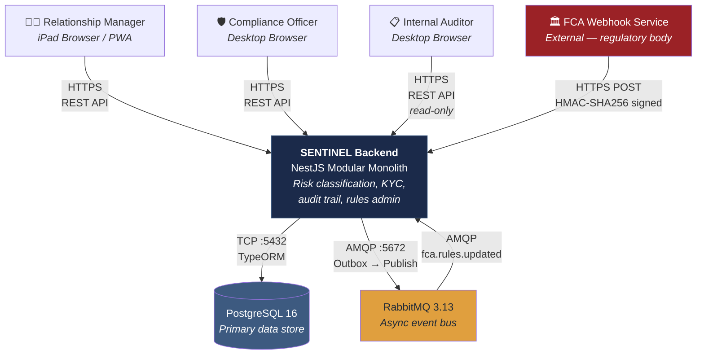
```mermaid
graph TB
    RM["🧑‍💼 Relationship Manager<br/><i>iPad Browser / PWA</i>"]
    CO["🛡️ Compliance Officer<br/><i>Desktop Browser</i>"]
    AU["📋 Internal Auditor<br/><i>Desktop Browser</i>"]
    FCA["🏛️ FCA Webhook Service<br/><i>External — regulatory body</i>"]

    SENTINEL["<b>SENTINEL Backend</b><br/>NestJS Modular Monolith<br/><i>Risk classification, KYC,<br/>audit trail, rules admin</i>"]

    PG[("PostgreSQL 16<br/><i>Primary data store</i>")]
    RMQ["RabbitMQ 3.13<br/><i>Async event bus</i>"]

    RM -- "HTTPS<br/>REST API" --> SENTINEL
    CO -- "HTTPS<br/>REST API" --> SENTINEL
    AU -- "HTTPS<br/>REST API<br/><i>read-only</i>" --> SENTINEL
    FCA -- "HTTPS POST<br/>HMAC-SHA256 signed" --> SENTINEL

    SENTINEL -- "TCP :5432<br/>TypeORM" --> PG
    SENTINEL -- "AMQP :5672<br/>Outbox → Publish" --> RMQ
    RMQ -- "AMQP<br/>fca.rules.updated" --> SENTINEL

    style SENTINEL fill:#1B2A4A,color:#fff,stroke:#3D5A80
    style PG fill:#3D5A80,color:#fff
    style RMQ fill:#E09F3E,color:#1F2937
    style FCA fill:#9B2226,color:#fff
```

### 1.2 Design Principles

| Principle                        | Application                                                                                |
| -------------------------------- | ------------------------------------------------------------------------------------------ |
| **Modular Monolith**             | Single deployable; internal DDD module boundaries as future microservice seams             |
| **Clean Architecture**           | Dependencies point inward: Infrastructure → Application → Domain                           |
| **Pure Rules Engine**            | `classify(record, rules) → result` — zero side effects, fully unit-testable                |
| **Config-Driven Classification** | All thresholds in a versioned JSON config; FCA updates require zero code changes           |
| **Append-Only Data**             | `onboarding_records` is immutable; corrections create new entries referencing the original |
| **Offline-First Sync**           | Client caches rules in IndexedDB; server re-classifies on sync (server is authoritative)   |

---

## 2. Container Architecture (C4 Level 2)

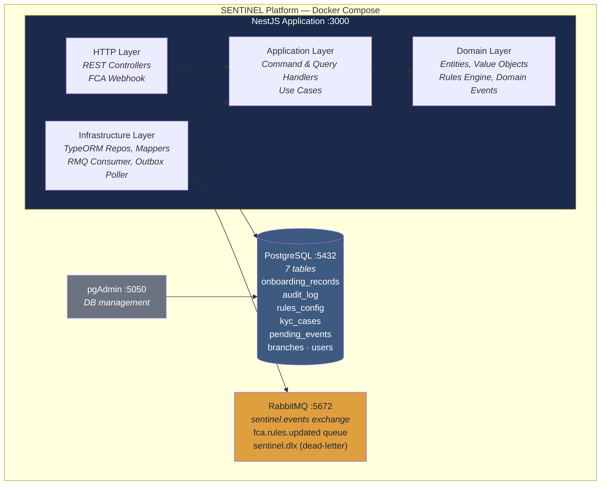
```mermaid
graph TB
    subgraph SENTINEL_PLATFORM["SENTINEL Platform — Docker Compose"]
        subgraph NESTJS["NestJS Application :3000"]
            HTTP["HTTP Layer<br/><i>REST Controllers<br/>FCA Webhook</i>"]
            APP["Application Layer<br/><i>Command & Query Handlers<br/>Use Cases</i>"]
            DOM["Domain Layer<br/><i>Entities, Value Objects<br/>Rules Engine, Domain Events</i>"]
            INFRA["Infrastructure Layer<br/><i>TypeORM Repos, Mappers<br/>RMQ Consumer, Outbox Poller</i>"]

            HTTP --> APP
            APP --> DOM
            INFRA --> APP
        end

        PG[("PostgreSQL :5432<br/><i>7 tables</i><br/>onboarding_records<br/>audit_log<br/>rules_config<br/>kyc_cases<br/>pending_events<br/>branches · users")]
        RMQ["RabbitMQ :5672<br/><i>sentinel.events exchange</i><br/>fca.rules.updated queue<br/>sentinel.dlx (dead-letter)"]
        PGA["pgAdmin :5050<br/><i>DB management</i>"]

        INFRA --> PG
        INFRA --> RMQ
        PGA --> PG
    end

    style NESTJS fill:#1B2A4A,color:#fff
    style PG fill:#3D5A80,color:#fff
    style RMQ fill:#E09F3E,color:#1F2937
    style PGA fill:#6B7280,color:#fff
```

---

## 3. Bounded Contexts

The backend is decomposed into five bounded contexts, each with its own module, domain, application, and infrastructure layers.

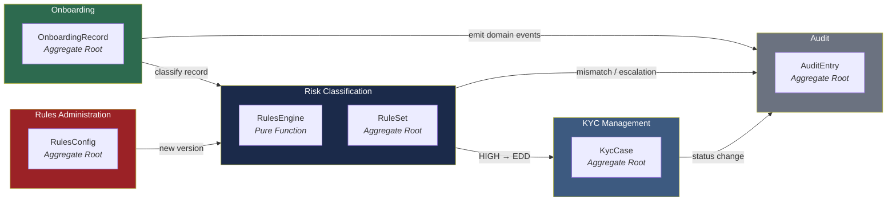
```mermaid
graph LR
    subgraph OB["Onboarding"]
        OB_AGG["OnboardingRecord<br/><i>Aggregate Root</i>"]
    end

    subgraph RC["Risk Classification"]
        RC_SVC["RulesEngine<br/><i>Pure Function</i>"]
        RC_AGG["RuleSet<br/><i>Aggregate Root</i>"]
    end

    subgraph KYC["KYC Management"]
        KYC_AGG["KycCase<br/><i>Aggregate Root</i>"]
    end

    subgraph AUD["Audit"]
        AUD_AGG["AuditEntry<br/><i>Aggregate Root</i>"]
    end

    subgraph RA["Rules Administration"]
        RA_AGG["RulesConfig<br/><i>Aggregate Root</i>"]
    end

    OB -- "classify record" --> RC
    OB -- "emit domain events" --> AUD
    RC -- "mismatch / escalation" --> AUD
    KYC -- "status change" --> AUD
    RA -- "new version" --> RC
    RC -- "HIGH → EDD" --> KYC

    style OB fill:#2D6A4F,color:#fff
    style RC fill:#1B2A4A,color:#fff
    style KYC fill:#3D5A80,color:#fff
    style AUD fill:#6B7280,color:#fff
    style RA fill:#9B2226,color:#fff
```

### 3.1 Context Responsibilities

| Context                 | Aggregate Root     | Key Use Cases                                              | Emits                                                                         |
| ----------------------- | ------------------ | ---------------------------------------------------------- | ----------------------------------------------------------------------------- |
| **Onboarding**          | `OnboardingRecord` | Submit record, CSV import, offline sync, submit correction | `RecordSubmitted`, `CsvImportCompleted`, `MismatchDetected`                   |
| **Risk Classification** | `RuleSet`          | Classify record, bulk re-classify after rules update       | `ClassificationComputed`, `MismatchDetected`, `BulkReclassificationCompleted` |
| **KYC Management**      | `KycCase`          | Update KYC status, escalate to EDD                         | `KycStatusUpdated`, `EddEscalationCreated`                                    |
| **Audit**               | `AuditEntry`       | Record audit entry, query audit trail                      | _(consumer only — does not emit)_                                             |
| **Rules Admin**         | `RulesConfig`      | Process FCA webhook, upload rules manually                 | `RulesConfigUpdated`                                                          |

---

## 4. Clean Architecture Layers

Each bounded context follows the same internal structure. Dependencies point **inward only**.

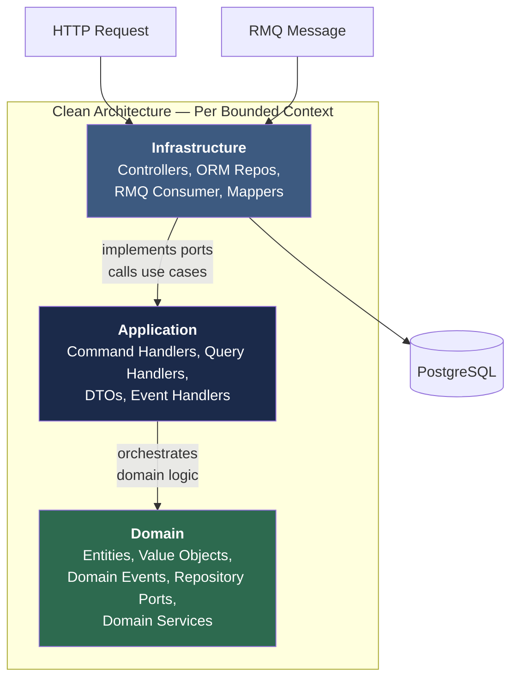
```mermaid
graph TB
    subgraph LAYERS["Clean Architecture — Per Bounded Context"]
        direction TB
        INF["<b>Infrastructure</b><br/>Controllers, ORM Repos,<br/>RMQ Consumer, Mappers"]
        APL["<b>Application</b><br/>Command Handlers, Query Handlers,<br/>DTOs, Event Handlers"]
        DMN["<b>Domain</b><br/>Entities, Value Objects,<br/>Domain Events, Repository Ports,<br/>Domain Services"]
    end

    INF -- "implements ports<br/>calls use cases" --> APL
    APL -- "orchestrates<br/>domain logic" --> DMN

    EXT_HTTP["HTTP Request"] --> INF
    EXT_RMQ["RMQ Message"] --> INF
    INF --> EXT_DB[("PostgreSQL")]

    style DMN fill:#2D6A4F,color:#fff
    style APL fill:#1B2A4A,color:#fff
    style INF fill:#3D5A80,color:#fff
```

### 4.1 Dependency Rule

```
src/<context>/
├── domain/           ← ZERO external dependencies (pure TypeScript)
│   ├── entities/
│   ├── value-objects/
│   ├── events/
│   ├── services/     ← Rules engine lives here (pure function)
│   └── ports/        ← Repository interfaces (not implementations)
├── application/      ← Depends ONLY on domain
│   ├── commands/     ← Write use cases
│   ├── queries/      ← Read use cases
│   └── dto/          ← Input/output contracts
└── infrastructure/   ← Depends on application + domain; implements ports
    ├── http/         ← NestJS controllers
    ├── persistence/  ← TypeORM repositories, ORM entities, mappers
    └── messaging/    ← RMQ consumers
```

---

## 5. Core Data Flows

### 5.1 New Onboarding Record (Happy Path)

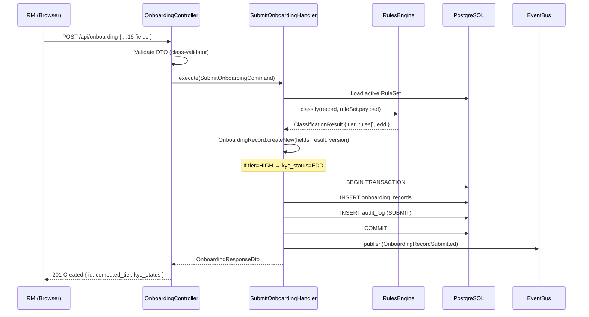
```mermaid
sequenceDiagram
    participant RM as RM (Browser)
    participant CTRL as OnboardingController
    participant CMD as SubmitOnboardingHandler
    participant RE as RulesEngine
    participant DB as PostgreSQL
    participant EB as EventBus

    RM->>CTRL: POST /api/onboarding { ...16 fields }
    CTRL->>CTRL: Validate DTO (class-validator)
    CTRL->>CMD: execute(SubmitOnboardingCommand)

    CMD->>DB: Load active RuleSet
    CMD->>RE: classify(record, ruleSet.payload)
    RE-->>CMD: ClassificationResult { tier, rules[], edd }

    CMD->>CMD: OnboardingRecord.createNew(fields, result, version)
    Note over CMD: If tier=HIGH → kyc_status=EDD

    CMD->>DB: BEGIN TRANSACTION
    CMD->>DB: INSERT onboarding_records
    CMD->>DB: INSERT audit_log (SUBMIT)
    CMD->>DB: COMMIT

    CMD->>EB: publish(OnboardingRecordSubmitted)
    CMD-->>CTRL: OnboardingResponseDto
    CTRL-->>RM: 201 Created { id, computed_tier, kyc_status }
```

### 5.2 FCA Webhook → Rules Update → Bulk Re-classification

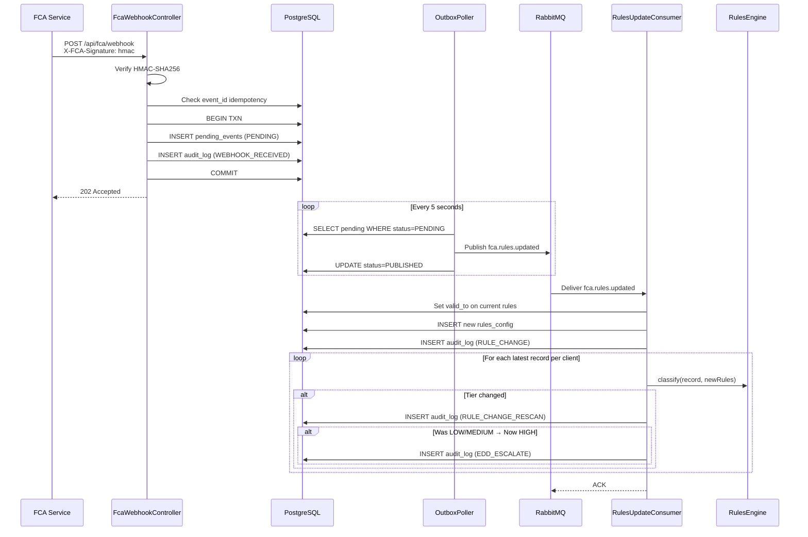
```mermaid
sequenceDiagram
    participant FCA as FCA Service
    participant WH as FcaWebhookController
    participant DB as PostgreSQL
    participant OP as OutboxPoller
    participant RMQ as RabbitMQ
    participant WK as RulesUpdateConsumer
    participant RE as RulesEngine

    FCA->>WH: POST /api/fca/webhook<br/>X-FCA-Signature: hmac
    WH->>WH: Verify HMAC-SHA256
    WH->>DB: Check event_id idempotency
    WH->>DB: BEGIN TXN
    WH->>DB: INSERT pending_events (PENDING)
    WH->>DB: INSERT audit_log (WEBHOOK_RECEIVED)
    WH->>DB: COMMIT
    WH-->>FCA: 202 Accepted

    loop Every 5 seconds
        OP->>DB: SELECT pending WHERE status=PENDING
        OP->>RMQ: Publish fca.rules.updated
        OP->>DB: UPDATE status=PUBLISHED
    end

    RMQ->>WK: Deliver fca.rules.updated
    WK->>DB: Set valid_to on current rules
    WK->>DB: INSERT new rules_config
    WK->>DB: INSERT audit_log (RULE_CHANGE)

    loop For each latest record per client
        WK->>RE: classify(record, newRules)
        alt Tier changed
            WK->>DB: INSERT audit_log (RULE_CHANGE_RESCAN)
            alt Was LOW/MEDIUM → Now HIGH
                WK->>DB: INSERT audit_log (EDD_ESCALATE)
            end
        end
    end

    WK-->>RMQ: ACK
```

### 5.3 CSV Import with Mismatch Detection

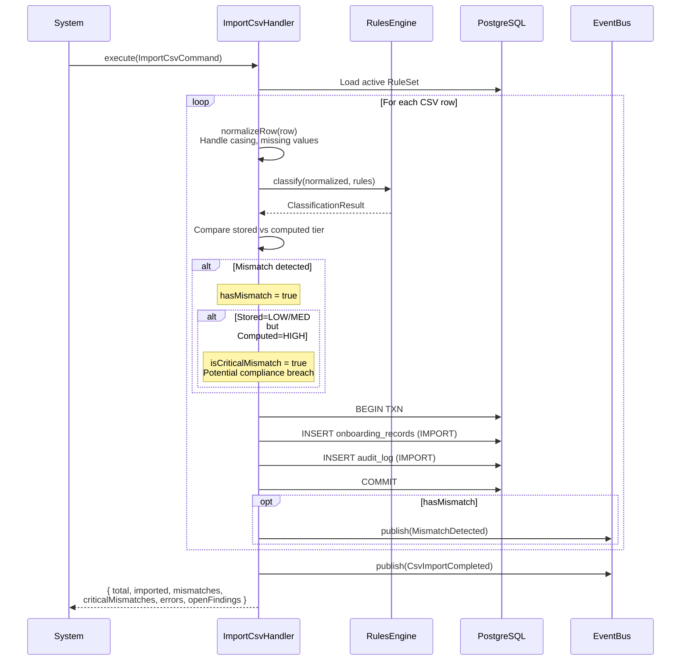
```mermaid
sequenceDiagram
    participant SYS as System
    participant IMP as ImportCsvHandler
    participant RE as RulesEngine
    participant DB as PostgreSQL
    participant EB as EventBus

    SYS->>IMP: execute(ImportCsvCommand)
    IMP->>DB: Load active RuleSet

    loop For each CSV row
        IMP->>IMP: normalizeRow(row)<br/>Handle casing, missing values
        IMP->>RE: classify(normalized, rules)
        RE-->>IMP: ClassificationResult

        IMP->>IMP: Compare stored vs computed tier

        alt Mismatch detected
            Note over IMP: hasMismatch = true
            alt Stored=LOW/MED but Computed=HIGH
                Note over IMP: isCriticalMismatch = true<br/>Potential compliance breach
            end
        end

        IMP->>DB: BEGIN TXN
        IMP->>DB: INSERT onboarding_records (IMPORT)
        IMP->>DB: INSERT audit_log (IMPORT)
        IMP->>DB: COMMIT

        opt hasMismatch
            IMP->>EB: publish(MismatchDetected)
        end
    end

    IMP->>EB: publish(CsvImportCompleted)
    IMP-->>SYS: { total, imported, mismatches,<br/>criticalMismatches, errors, openFindings }
```

### 5.4 Offline Sync with Rules Version Check

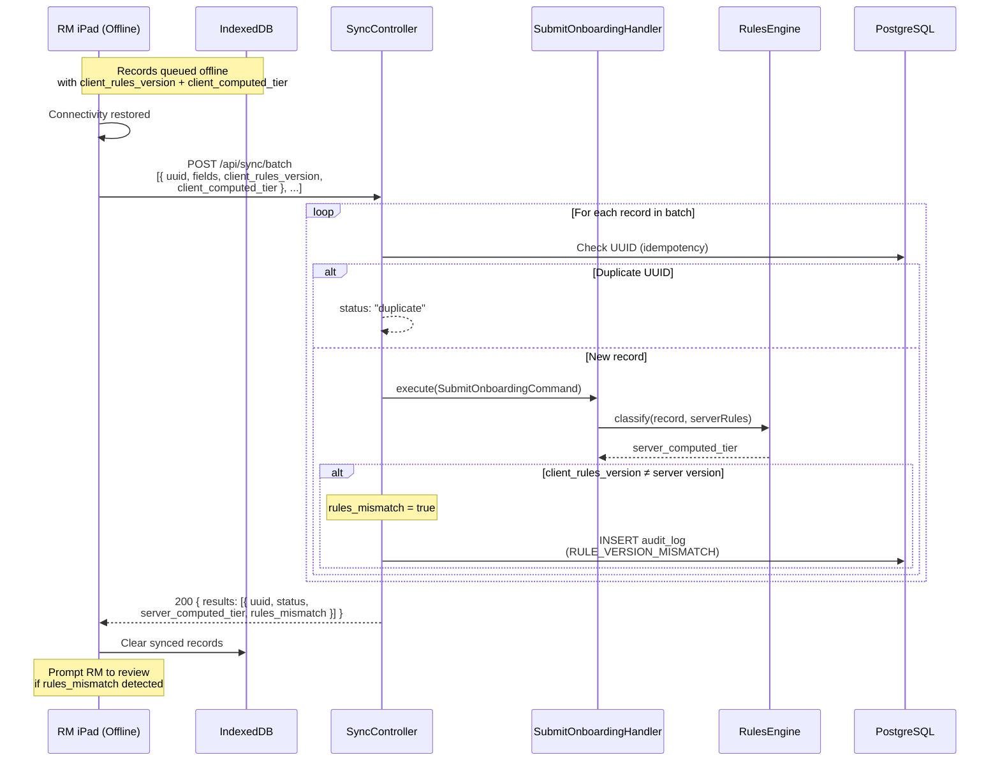
```mermaid
sequenceDiagram
    participant RM as RM iPad (Offline)
    participant IDB as IndexedDB
    participant SYNC as SyncController
    participant CMD as SubmitOnboardingHandler
    participant RE as RulesEngine
    participant DB as PostgreSQL

    Note over RM,IDB: Records queued offline<br/>with client_rules_version + client_computed_tier

    RM->>RM: Connectivity restored

    RM->>SYNC: POST /api/sync/batch<br/>[{ uuid, fields, client_rules_version,<br/>client_computed_tier }, ...]

    loop For each record in batch
        SYNC->>DB: Check UUID (idempotency)
        alt Duplicate UUID
            SYNC-->>SYNC: status: "duplicate"
        else New record
            SYNC->>CMD: execute(SubmitOnboardingCommand)
            CMD->>RE: classify(record, serverRules)
            RE-->>CMD: server_computed_tier

            alt client_rules_version ≠ server version
                Note over SYNC: rules_mismatch = true
                SYNC->>DB: INSERT audit_log<br/>(RULE_VERSION_MISMATCH)
            end
        end
    end

    SYNC-->>RM: 200 { results: [{ uuid, status,<br/>server_computed_tier, rules_mismatch }] }
    RM->>IDB: Clear synced records
    Note over RM: Prompt RM to review<br/>if rules_mismatch detected
```

### 5.5 Client-Side Rules Polling

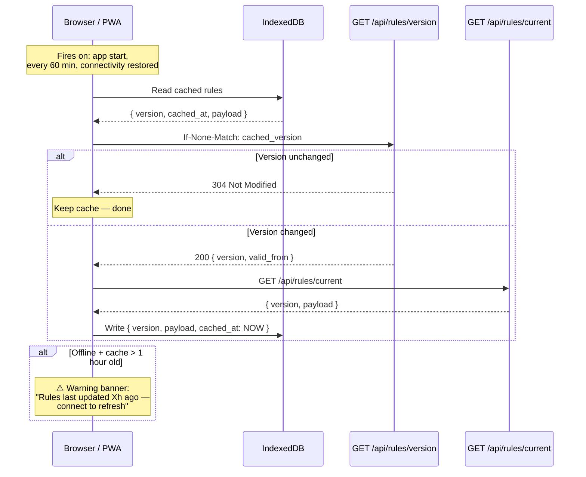
```mermaid
sequenceDiagram
    participant APP as Browser / PWA
    participant IDB as IndexedDB
    participant API as GET /api/rules/version
    participant FULL as GET /api/rules/current

    Note over APP: Fires on: app start,<br/>every 60 min, connectivity restored

    APP->>IDB: Read cached rules
    IDB-->>APP: { version, cached_at, payload }

    APP->>API: If-None-Match: cached_version
    alt Version unchanged
        API-->>APP: 304 Not Modified
        Note over APP: Keep cache — done
    else Version changed
        API-->>APP: 200 { version, valid_from }
        APP->>FULL: GET /api/rules/current
        FULL-->>APP: { version, payload }
        APP->>IDB: Write { version, payload, cached_at: NOW }
    end

    alt Offline + cache > 1 hour old
        Note over APP: ⚠️ Warning banner:<br/>"Rules last updated Xh ago —<br/>connect to refresh"
    end
```

---

## 6. Domain Event Flow

All bounded contexts communicate through domain events. In the POC, these are dispatched synchronously in-process via NestJS `EventBus`. The Audit context consumes all events.

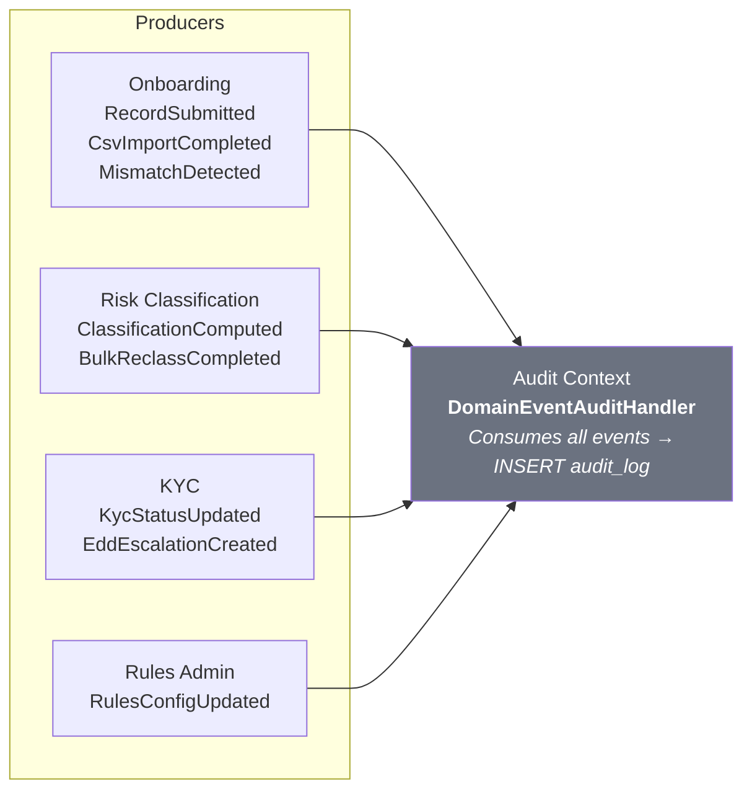
```mermaid
graph LR
    subgraph Producers
        OB_E["Onboarding<br/>RecordSubmitted<br/>CsvImportCompleted<br/>MismatchDetected"]
        RC_E["Risk Classification<br/>ClassificationComputed<br/>BulkReclassCompleted"]
        KYC_E["KYC<br/>KycStatusUpdated<br/>EddEscalationCreated"]
        RA_E["Rules Admin<br/>RulesConfigUpdated"]
    end

    AUD_H["Audit Context<br/><b>DomainEventAuditHandler</b><br/><i>Consumes all events →<br/>INSERT audit_log</i>"]

    OB_E --> AUD_H
    RC_E --> AUD_H
    KYC_E --> AUD_H
    RA_E --> AUD_H

    style AUD_H fill:#6B7280,color:#fff
```

### 6.1 Event Dispatch Model

| Scope                        | Mechanism                           | Use                                                      |
| ---------------------------- | ----------------------------------- | -------------------------------------------------------- |
| **In-process domain events** | NestJS `@nestjs/cqrs` `EventBus`    | Synchronous — audit logging, KYC escalation              |
| **Cross-process events**     | RabbitMQ (via transactional outbox) | Durable — FCA webhook → rules update → re-classification |

There is **no separate worker process** in the POC. The RMQ consumer (`RulesUpdateConsumer`) and the outbox poller (`OutboxPollerService`) both run in-process within the same NestJS instance.

---

## 7. Database Architecture

### 7.1 Entity Relationship Diagram

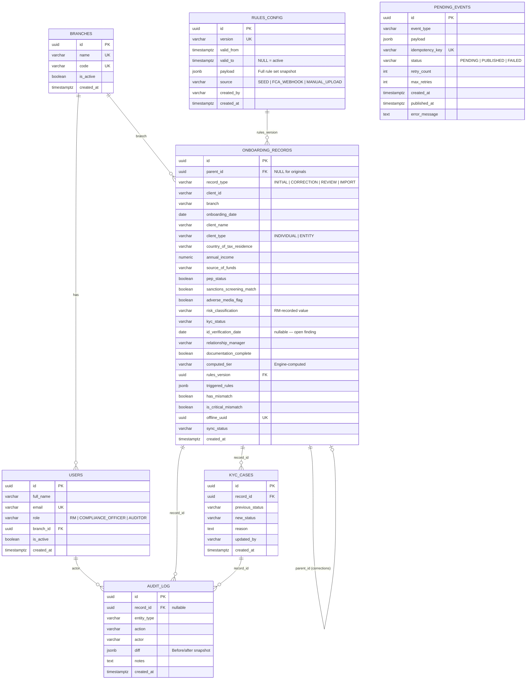
```mermaid
erDiagram
    BRANCHES {
        uuid id PK
        varchar name UK
        varchar code UK
        boolean is_active
        timestamptz created_at
    }

    USERS {
        uuid id PK
        varchar full_name
        varchar email UK
        varchar role "RM | COMPLIANCE_OFFICER | AUDITOR"
        uuid branch_id FK
        boolean is_active
        timestamptz created_at
    }

    RULES_CONFIG {
        uuid id PK
        varchar version UK
        timestamptz valid_from
        timestamptz valid_to "NULL = active"
        jsonb payload "Full rule set snapshot"
        varchar source "SEED | FCA_WEBHOOK | MANUAL_UPLOAD"
        varchar created_by
        timestamptz created_at
    }

    ONBOARDING_RECORDS {
        uuid id PK
        uuid parent_id FK "NULL for originals"
        varchar record_type "INITIAL | CORRECTION | REVIEW | IMPORT"
        varchar client_id
        varchar branch
        date onboarding_date
        varchar client_name
        varchar client_type "INDIVIDUAL | ENTITY"
        varchar country_of_tax_residence
        numeric annual_income
        varchar source_of_funds
        boolean pep_status
        boolean sanctions_screening_match
        boolean adverse_media_flag
        varchar risk_classification "RM-recorded value"
        varchar kyc_status
        date id_verification_date "nullable — open finding"
        varchar relationship_manager
        boolean documentation_complete
        varchar computed_tier "Engine-computed"
        uuid rules_version FK
        jsonb triggered_rules
        boolean has_mismatch
        boolean is_critical_mismatch
        uuid offline_uuid UK
        varchar sync_status
        timestamptz created_at
    }

    KYC_CASES {
        uuid id PK
        uuid record_id FK
        varchar previous_status
        varchar new_status
        text reason
        varchar updated_by
        timestamptz created_at
    }

    AUDIT_LOG {
        uuid id PK
        uuid record_id FK "nullable"
        varchar entity_type
        varchar action
        varchar actor
        jsonb diff "Before/after snapshot"
        text notes
        timestamptz created_at
    }

    PENDING_EVENTS {
        uuid id PK
        varchar event_type
        jsonb payload
        varchar idempotency_key UK
        varchar status "PENDING | PUBLISHED | FAILED"
        int retry_count
        int max_retries
        timestamptz created_at
        timestamptz published_at
        text error_message
    }

    BRANCHES ||--o{ USERS : "has"
    BRANCHES ||--o{ ONBOARDING_RECORDS : "branch"
    USERS ||--o{ AUDIT_LOG : "actor"
    RULES_CONFIG ||--o{ ONBOARDING_RECORDS : "rules_version"
    ONBOARDING_RECORDS ||--o| ONBOARDING_RECORDS : "parent_id (corrections)"
    ONBOARDING_RECORDS ||--o{ KYC_CASES : "record_id"
    ONBOARDING_RECORDS ||--o{ AUDIT_LOG : "record_id"
    KYC_CASES ||--o{ AUDIT_LOG : "record_id"
```

### 7.2 Immutability Enforcement

`onboarding_records` is protected by PostgreSQL triggers that prevent `UPDATE` and `DELETE`:

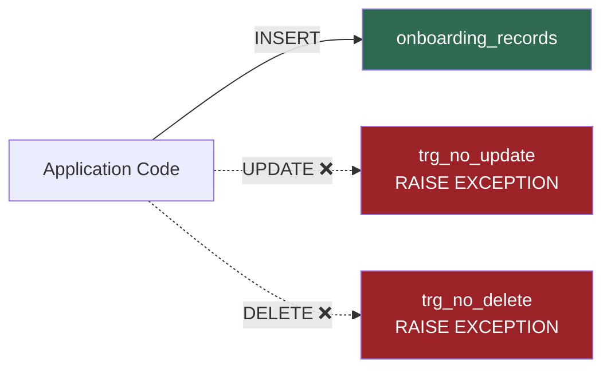
```mermaid
graph LR
    APP["Application Code"] -- "INSERT" --> OB_TABLE["onboarding_records"]
    APP -. "UPDATE ❌" .-> TRG_U["trg_no_update<br/>RAISE EXCEPTION"]
    APP -. "DELETE ❌" .-> TRG_D["trg_no_delete<br/>RAISE EXCEPTION"]

    style TRG_U fill:#9B2226,color:#fff
    style TRG_D fill:#9B2226,color:#fff
    style OB_TABLE fill:#2D6A4F,color:#fff
```

### 7.3 Key Indexes

| Table                | Index                                       | Purpose                         |
| -------------------- | ------------------------------------------- | ------------------------------- |
| `onboarding_records` | `branch`                                    | Branch-level filtering          |
| `onboarding_records` | `computed_tier`                             | Risk dashboard KPIs             |
| `onboarding_records` | `has_mismatch WHERE TRUE`                   | Partial index for mismatch scan |
| `onboarding_records` | `offline_uuid WHERE NOT NULL`               | Idempotent sync dedup           |
| `audit_log`          | `created_at DESC`                           | Chronological audit trail       |
| `audit_log`          | `record_id`                                 | Per-record audit history        |
| `rules_config`       | `valid_from DESC WHERE valid_to IS NULL`    | Active rule lookup              |
| `pending_events`     | `status, created_at WHERE status='PENDING'` | Outbox poller efficiency        |

---

## 8. API Surface

### 8.1 Endpoint Map

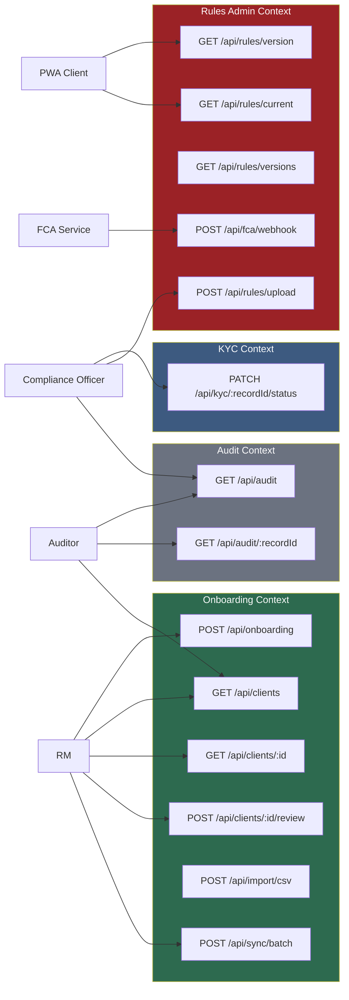
```mermaid
graph LR
    subgraph ONBOARDING["Onboarding Context"]
        POST_OB["POST /api/onboarding"]
        GET_CL["GET /api/clients"]
        GET_CLD["GET /api/clients/:id"]
        POST_REV["POST /api/clients/:id/review"]
        POST_CSV["POST /api/import/csv"]
        POST_SYNC["POST /api/sync/batch"]
    end

    subgraph KYC_API["KYC Context"]
        PATCH_KYC["PATCH /api/kyc/:recordId/status"]
    end

    subgraph AUDIT_API["Audit Context"]
        GET_AUD["GET /api/audit"]
        GET_AUDR["GET /api/audit/:recordId"]
    end

    subgraph RULES_API["Rules Admin Context"]
        GET_VER["GET /api/rules/version"]
        GET_CUR["GET /api/rules/current"]
        GET_VERS["GET /api/rules/versions"]
        POST_UPL["POST /api/rules/upload"]
        POST_WH["POST /api/fca/webhook"]
    end

    RM["RM"] --> POST_OB & GET_CL & GET_CLD & POST_REV & POST_SYNC
    CO["Compliance Officer"] --> PATCH_KYC & POST_UPL & GET_AUD
    AUDITOR["Auditor"] --> GET_AUD & GET_AUDR & GET_CL
    FCA_SVC["FCA Service"] --> POST_WH
    PWA["PWA Client"] --> GET_VER & GET_CUR

    style ONBOARDING fill:#2D6A4F,color:#fff
    style KYC_API fill:#3D5A80,color:#fff
    style AUDIT_API fill:#6B7280,color:#fff
    style RULES_API fill:#9B2226,color:#fff
```

### 8.2 Endpoint Details

| Method  | Path                        | Context     | Actor           | Description                                   |
| ------- | --------------------------- | ----------- | --------------- | --------------------------------------------- |
| `POST`  | `/api/onboarding`           | Onboarding  | RM              | Submit new onboarding record; auto-classifies |
| `GET`   | `/api/clients`              | Onboarding  | RM, CO, Auditor | List clients (filter: branch, risk, KYC, RM)  |
| `GET`   | `/api/clients/:id`          | Onboarding  | RM, CO, Auditor | Record detail + correction chain              |
| `POST`  | `/api/clients/:id/review`   | Onboarding  | RM              | Submit correction (new record, not overwrite) |
| `POST`  | `/api/import/csv`           | Onboarding  | System          | Bulk CSV import + mismatch scan               |
| `POST`  | `/api/sync/batch`           | Onboarding  | RM (offline)    | Idempotent batch sync of offline records      |
| `PATCH` | `/api/kyc/:recordId/status` | KYC         | CO              | Update KYC status with required reason        |
| `GET`   | `/api/audit`                | Audit       | Auditor         | Full audit log (filter: date, branch, actor)  |
| `GET`   | `/api/audit/:recordId`      | Audit       | Auditor         | Audit trail for a specific record             |
| `GET`   | `/api/rules/version`        | Rules Admin | Any             | Lightweight version poll (ETag / 304 support) |
| `GET`   | `/api/rules/current`        | Rules Admin | Any             | Full active rule set payload                  |
| `GET`   | `/api/rules/versions`       | Rules Admin | CO, Auditor     | All historical rule versions                  |
| `POST`  | `/api/rules/upload`         | Rules Admin | CO              | Manual rule set upload                        |
| `POST`  | `/api/fca/webhook`          | Rules Admin | FCA (external)  | HMAC-signed regulatory update                 |

---

## 9. Rules Engine Architecture

The rules engine is the most critical component. It is a **pure function** with zero dependencies — no database, no framework, no side effects.

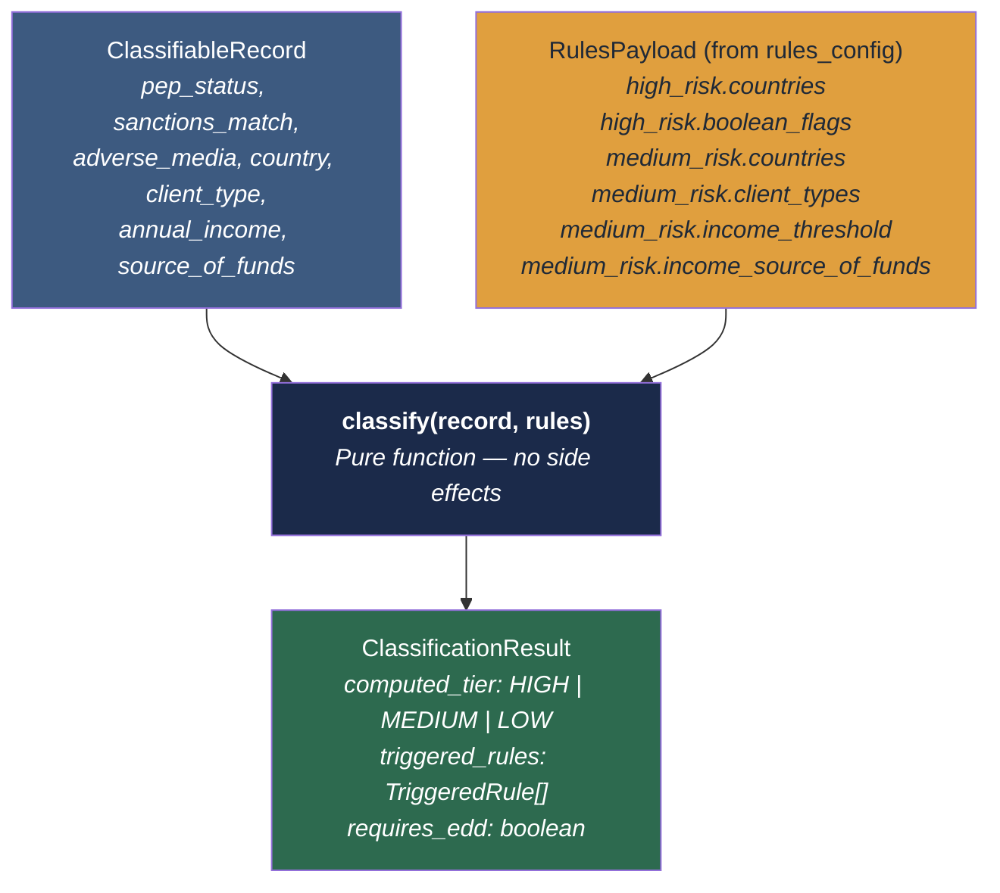
```mermaid
graph TB
    INPUT["ClassifiableRecord<br/><i>pep_status, sanctions_match,<br/>adverse_media, country, client_type,<br/>annual_income, source_of_funds</i>"]
    CONFIG["RulesPayload (from rules_config)<br/><i>high_risk.countries<br/>high_risk.boolean_flags<br/>medium_risk.countries<br/>medium_risk.client_types<br/>medium_risk.income_threshold<br/>medium_risk.income_source_of_funds</i>"]

    ENGINE["<b>classify(record, rules)</b><br/><i>Pure function — no side effects</i>"]

    OUTPUT["ClassificationResult<br/><i>computed_tier: HIGH | MEDIUM | LOW<br/>triggered_rules: TriggeredRule[]<br/>requires_edd: boolean</i>"]

    INPUT --> ENGINE
    CONFIG --> ENGINE
    ENGINE --> OUTPUT

    style ENGINE fill:#1B2A4A,color:#fff
    style INPUT fill:#3D5A80,color:#fff
    style CONFIG fill:#E09F3E,color:#1F2937
    style OUTPUT fill:#2D6A4F,color:#fff
```

### 9.1 Classification Logic

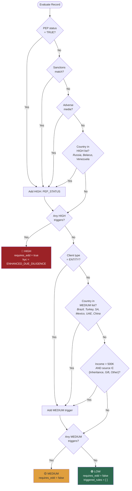
```mermaid
flowchart TD
    START(["Evaluate Record"]) --> H1{"PEP status<br/>= TRUE?"}
    H1 -- Yes --> HIGH_TRIGGERED["Add HIGH: PEP_STATUS"]
    H1 -- No --> H2{"Sanctions<br/>match?"}
    H2 -- Yes --> HIGH_TRIGGERED
    H2 -- No --> H3{"Adverse<br/>media?"}
    H3 -- Yes --> HIGH_TRIGGERED
    H3 -- No --> H4{"Country in<br/>HIGH list?<br/><i>Russia, Belarus,<br/>Venezuela</i>"}
    H4 -- Yes --> HIGH_TRIGGERED

    HIGH_TRIGGERED --> HIGH_CHECK{"Any HIGH<br/>triggers?"}
    H4 -- No --> HIGH_CHECK

    HIGH_CHECK -- Yes --> HIGH_RESULT["🔴 HIGH<br/>requires_edd = true<br/>kyc = ENHANCED_DUE_DILIGENCE"]
    HIGH_CHECK -- No --> M1{"Client type<br/>= ENTITY?"}

    M1 -- Yes --> MED_TRIGGERED["Add MEDIUM trigger"]
    M1 -- No --> M2{"Country in<br/>MEDIUM list?<br/><i>Brazil, Turkey, SA,<br/>Mexico, UAE, China</i>"}
    M2 -- Yes --> MED_TRIGGERED
    M2 -- No --> M3{"Income > 500K<br/>AND source ∈<br/>{Inheritance, Gift, Other}?"}
    M3 -- Yes --> MED_TRIGGERED

    MED_TRIGGERED --> MED_CHECK{"Any MEDIUM<br/>triggers?"}
    M3 -- No --> MED_CHECK

    MED_CHECK -- Yes --> MED_RESULT["🟡 MEDIUM<br/>requires_edd = false"]
    MED_CHECK -- No --> LOW_RESULT["🟢 LOW<br/>requires_edd = false<br/>triggered_rules = [ ]"]

    style HIGH_RESULT fill:#9B2226,color:#fff
    style MED_RESULT fill:#E09F3E,color:#1F2937
    style LOW_RESULT fill:#2D6A4F,color:#fff
```

### 9.2 Why Pure Function Matters

- **FCA Audit:** Same inputs always produce the same output — assessments are reproducible
- **Testable:** 20+ unit tests without DB, framework, or HTTP mocks
- **Config-driven:** Country lists, income thresholds, and source-of-funds categories come from `RulesPayload` — never hardcoded
- **Version-linked:** Every `onboarding_records` row stores the `rules_version` FK — any past assessment can be reconstructed

---

## 10. Transactional Outbox Pattern

The outbox pattern ensures that database writes and message publishing are never out of sync — a lost FCA rules update would be a regulatory breach.

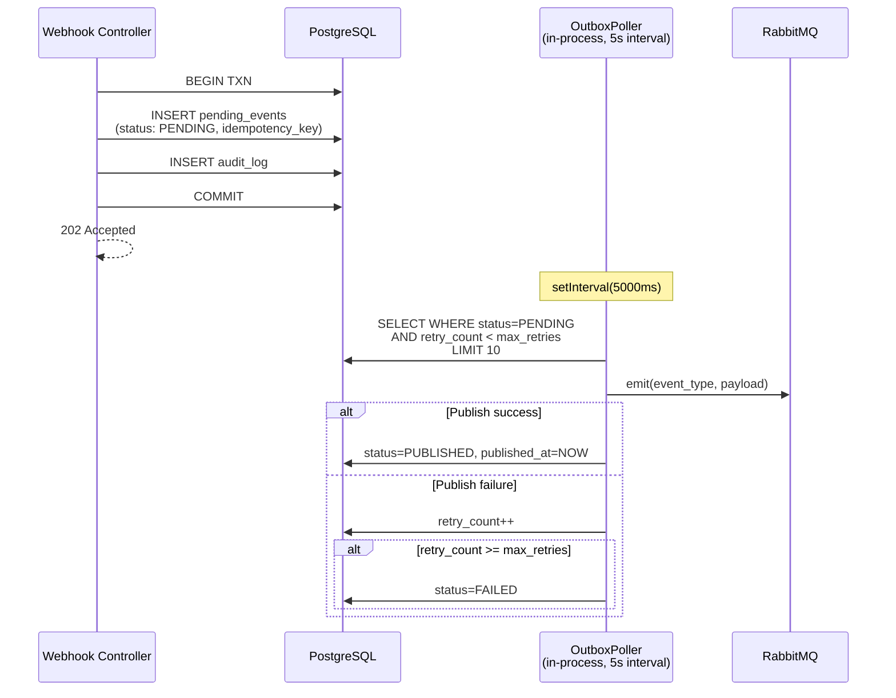
```mermaid
sequenceDiagram
    participant CTRL as Webhook Controller
    participant DB as PostgreSQL
    participant POLL as OutboxPoller<br/>(in-process, 5s interval)
    participant RMQ as RabbitMQ

    CTRL->>DB: BEGIN TXN
    CTRL->>DB: INSERT pending_events<br/>(status: PENDING, idempotency_key)
    CTRL->>DB: INSERT audit_log
    CTRL->>DB: COMMIT
    CTRL-->>CTRL: 202 Accepted

    Note over POLL: setInterval(5000ms)
    POLL->>DB: SELECT WHERE status=PENDING<br/>AND retry_count < max_retries<br/>LIMIT 10
    POLL->>RMQ: emit(event_type, payload)

    alt Publish success
        POLL->>DB: status=PUBLISHED, published_at=NOW
    else Publish failure
        POLL->>DB: retry_count++
        alt retry_count >= max_retries
            POLL->>DB: status=FAILED
        end
    end
```

---

## 11. Security Architecture

### 11.1 Request Authentication Flow

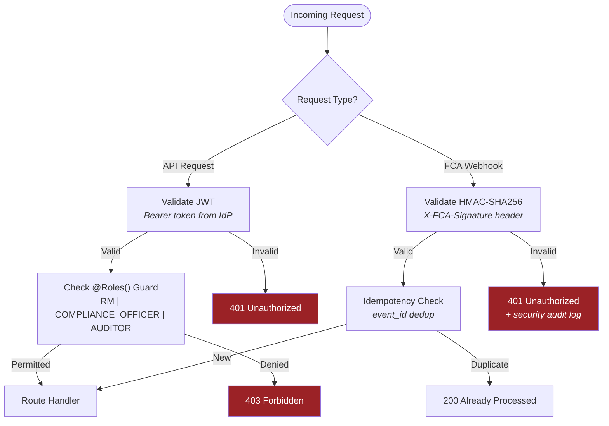
```mermaid
flowchart TD
    REQ(["Incoming Request"]) --> TYPE{"Request Type?"}

    TYPE -- "API Request" --> JWT["Validate JWT<br/><i>Bearer token from IdP</i>"]
    TYPE -- "FCA Webhook" --> HMAC["Validate HMAC-SHA256<br/><i>X-FCA-Signature header</i>"]

    JWT -- Valid --> ROLES["Check @Roles() Guard<br/>RM | COMPLIANCE_OFFICER | AUDITOR"]
    JWT -- Invalid --> R401["401 Unauthorized"]
    HMAC -- Valid --> IDEMP["Idempotency Check<br/><i>event_id dedup</i>"]
    HMAC -- Invalid --> R401_H["401 Unauthorized<br/><i>+ security audit log</i>"]

    ROLES -- Permitted --> HANDLER["Route Handler"]
    ROLES -- Denied --> R403["403 Forbidden"]
    IDEMP -- New --> HANDLER
    IDEMP -- Duplicate --> R200["200 Already Processed"]

    style R401 fill:#9B2226,color:#fff
    style R401_H fill:#9B2226,color:#fff
    style R403 fill:#9B2226,color:#fff
```

### 11.2 OWASP Top 10 Mitigations

| OWASP Risk                      | Mitigation                                                              |
| ------------------------------- | ----------------------------------------------------------------------- |
| A01 — Broken Access Control     | RBAC guards on every route; DB-level RLS per branch                     |
| A02 — Cryptographic Failures    | HMAC-SHA256 webhook verification; TLS in transit; encryption at rest    |
| A03 — Injection                 | TypeORM parameterized queries; class-validator DTO validation           |
| A04 — Insecure Design           | Append-only tables; DB triggers prevent UPDATE/DELETE                   |
| A05 — Security Misconfiguration | Secrets via env vars; Helmet middleware; restrictive CORS               |
| A07 — Auth Failures             | Rate limiting on webhook; JWT expiry; timing-safe HMAC compare          |
| A08 — Data Integrity Failures   | JSON Schema validation on rules payload; `rules_version` FK linkage     |
| A09 — Logging Failures          | All security events (HMAC failures, auth denials) logged to `audit_log` |

---

## 12. Module Wiring

### 12.1 NestJS Module Dependency Graph

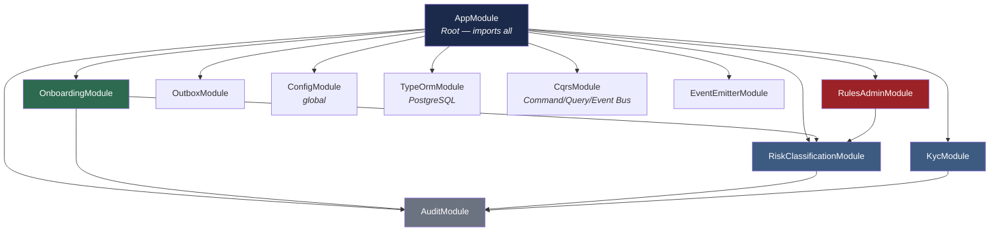
```mermaid
graph TB
    ROOT["AppModule<br/><i>Root — imports all</i>"]

    ROOT --> OBM["OnboardingModule"]
    ROOT --> RCM["RiskClassificationModule"]
    ROOT --> KYCM["KycModule"]
    ROOT --> AUDM["AuditModule"]
    ROOT --> RAM["RulesAdminModule"]
    ROOT --> OUTM["OutboxModule"]

    ROOT --> CFG["ConfigModule<br/><i>global</i>"]
    ROOT --> TOM["TypeOrmModule<br/><i>PostgreSQL</i>"]
    ROOT --> CQRS["CqrsModule<br/><i>Command/Query/Event Bus</i>"]
    ROOT --> EEM["EventEmitterModule"]

    OBM --> RCM
    OBM --> AUDM
    RCM --> AUDM
    KYCM --> AUDM
    RAM --> RCM

    style ROOT fill:#1B2A4A,color:#fff
    style OBM fill:#2D6A4F,color:#fff
    style RCM fill:#3D5A80,color:#fff
    style KYCM fill:#3D5A80,color:#fff
    style AUDM fill:#6B7280,color:#fff
    style RAM fill:#9B2226,color:#fff
```

### 12.2 Port → Adapter Binding (DI)

Each bounded context declares repository **ports** (interfaces) in the domain layer and binds **adapters** (TypeORM implementations) in the module:

```typescript
// OnboardingModule — provider binding
{
  provide: ONBOARDING_RECORD_REPOSITORY,    // Port token
  useClass: OnboardingRecordTypeOrmRepository  // Adapter
}
```

This means swapping PostgreSQL for another store requires changing only the adapter — domain and application layers are untouched.

---

## 13. Infrastructure Topology

### 13.1 POC (Docker Compose)

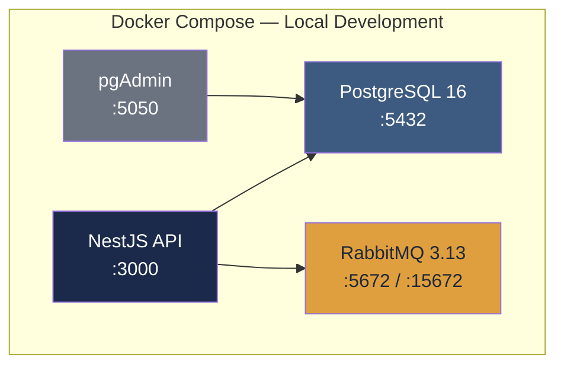
```mermaid
graph TB
    subgraph DOCKER["Docker Compose — Local Development"]
        API["NestJS API<br/>:3000"]
        PG["PostgreSQL 16<br/>:5432"]
        RMQ["RabbitMQ 3.13<br/>:5672 / :15672"]
        PGA["pgAdmin<br/>:5050"]
    end

    API --> PG
    API --> RMQ
    PGA --> PG

    style API fill:#1B2A4A,color:#fff
    style PG fill:#3D5A80,color:#fff
    style RMQ fill:#E09F3E,color:#1F2937
    style PGA fill:#6B7280,color:#fff
```

**No Prometheus/Grafana in POC** — NestJS built-in logging + RabbitMQ management UI provide sufficient observability for the prototype phase.

### 13.2 Production Target

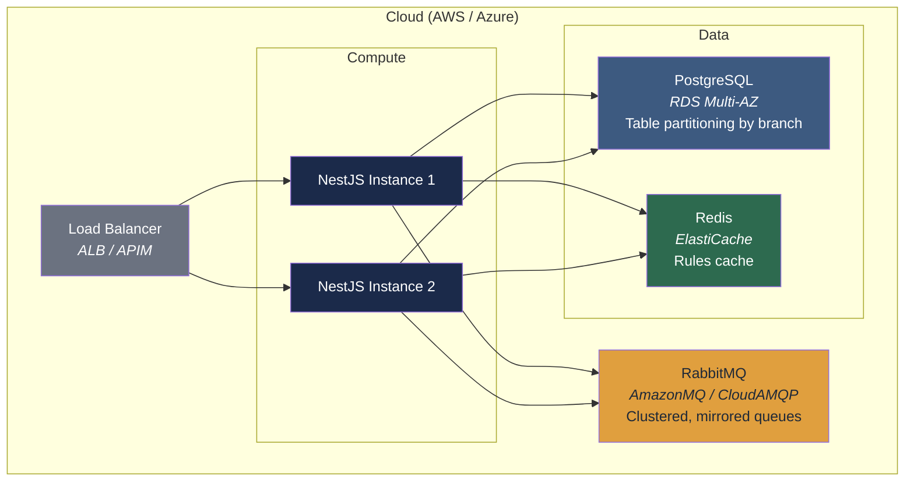
```mermaid
graph TB
    subgraph CLOUD["Cloud (AWS / Azure)"]
        LB["Load Balancer<br/><i>ALB / APIM</i>"]

        subgraph COMPUTE["Compute"]
            API1["NestJS Instance 1"]
            API2["NestJS Instance 2"]
        end

        subgraph DATA["Data"]
            PG_PROD["PostgreSQL<br/><i>RDS Multi-AZ</i><br/>Table partitioning by branch"]
            REDIS["Redis<br/><i>ElastiCache</i><br/>Rules cache"]
        end

        RMQ_PROD["RabbitMQ<br/><i>AmazonMQ / CloudAMQP</i><br/>Clustered, mirrored queues"]
    end

    LB --> API1 & API2
    API1 & API2 --> PG_PROD
    API1 & API2 --> REDIS
    API1 & API2 --> RMQ_PROD

    style LB fill:#6B7280,color:#fff
    style API1 fill:#1B2A4A,color:#fff
    style API2 fill:#1B2A4A,color:#fff
    style PG_PROD fill:#3D5A80,color:#fff
    style REDIS fill:#2D6A4F,color:#fff
    style RMQ_PROD fill:#E09F3E,color:#1F2937
```

---

## 14. Scaling Strategy (4 → 15 Branches)

```mermaid
graph LR
    subgraph NOW["POC — 4 Branches"]
        N1["Single NestJS instance"]
        N2["Single PostgreSQL"]
        N3["In-memory rules cache"]
        N4["Query-level branch filter"]
    end

    subgraph TARGET["Production — 15 Branches"]
        T1["2+ NestJS replicas<br/>behind load balancer"]
        T2["PG with table partitioning<br/>by branch + read replicas"]
        T3["Redis cluster<br/>shared rules cache"]
        T4["Row-Level Security<br/>branch-scoped JWT claims"]
    end

    N1 -- "scale out" --> T1
    N2 -- "partition + replicate" --> T2
    N3 -- "externalize" --> T3
    N4 -- "enforce at DB" --> T4
```

---

## 15. Technology Stack

| Layer            | Technology                            | Justification                                        |
| ---------------- | ------------------------------------- | ---------------------------------------------------- |
| Runtime          | Node.js 20 LTS                        | Non-blocking I/O, team familiarity                   |
| Framework        | NestJS 10+                            | Modular DI, first-class CQRS/RMQ support             |
| Language         | TypeScript 5+                         | Type safety across domain, DTOs, infra               |
| ORM              | TypeORM                               | NestJS integration, migrations, query builder        |
| Database         | PostgreSQL 16                         | JSONB, partitioning, RLS, ACID, append-only triggers |
| Message Broker   | RabbitMQ 3.13+                        | Durable messaging, DLQ, topic exchanges              |
| Validation       | class-validator + class-transformer   | DTO validation at API boundary                       |
| Caching          | In-memory (POC) → Redis (prod)        | Active rules config hot cache                        |
| API Docs         | Swagger / OpenAPI (`@nestjs/swagger`) | Auto-generated from decorators                       |
| Testing          | Jest + Supertest                      | Unit (domain pure functions), integration (API), e2e |
| Containerization | Docker + Docker Compose               | Local dev parity; 4 containers in POC                |

---

## 16. Architecture Decision Records

| #                                                   | Decision                        | Rationale                                                                 |
| --------------------------------------------------- | ------------------------------- | ------------------------------------------------------------------------- |
| [ADR-0001](./adr/0001-nestjs-monolith.md)           | NestJS modular monolith         | Single deployment for POC; module boundaries as future microservice seams |
| [ADR-0002](./adr/0002-ddd-clean-architecture.md)    | DDD + Clean Architecture        | Pure domain layer; rules engine testable without framework/DB             |
| [ADR-0003](./adr/0003-postgresql-persistence.md)    | PostgreSQL persistence          | JSONB for flexible rule storage; ACID for record + audit atomicity        |
| [ADR-0004](./adr/0004-rabbitmq-event-bus.md)        | RabbitMQ + transactional outbox | Durable async processing; outbox prevents lost FCA updates                |
| [ADR-0005](./adr/0005-fca-webhook-integration.md)   | HMAC-secured FCA webhook        | HMAC-SHA256 verification; idempotent; 202 Accepted pattern                |
| [ADR-0006](./adr/0006-immutable-audit-trail.md)     | Immutable audit trail           | DB triggers enforce append-only; FCA MLR 2017 compliance                  |
| [ADR-0007](./adr/0007-rules-engine-versioning.md)   | Versioned rules config          | Every assessment linked to exact rules version; audit reconstructable     |
| [ADR-0008](./adr/0008-client-side-rules-polling.md) | Client-side rules polling       | Hourly HTTP poll; no WebSocket dependency; works offline                  |

---

## 17. What This POC Intentionally Excludes

| Excluded                | Reason                                            | Production Path                            |
| ----------------------- | ------------------------------------------------- | ------------------------------------------ |
| Full JWT authentication | Auth is mocked; no IdP integration                | Corporate IdP / OAuth2 + JWT               |
| Prometheus / Grafana    | Overkill for 46 records; NestJS logger suffices   | Add when SLA monitoring is needed          |
| Separate worker process | RMQ consumer runs in-process                      | Extract to dedicated pod under load        |
| Redis cache             | In-memory cache is sufficient for single instance | Redis cluster when scaling to 2+ instances |
| Live sanctions API      | PEP/sanctions are RM-declared fields              | Integrate with WorldCheck / Dow Jones      |
| CI/CD pipeline          | Local Docker Compose only                         | GitHub Actions → container registry → K8s  |
