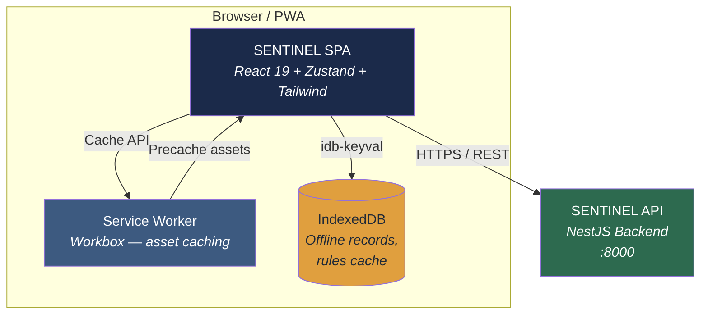
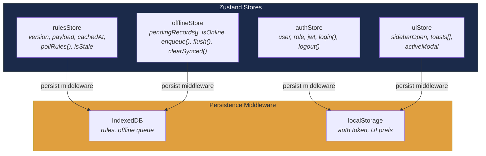
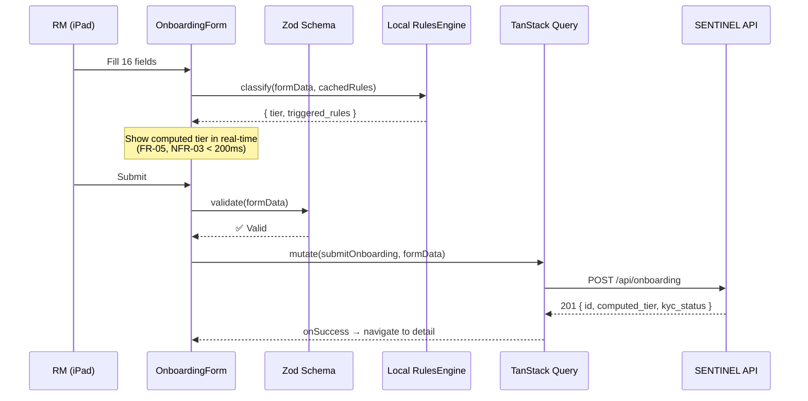
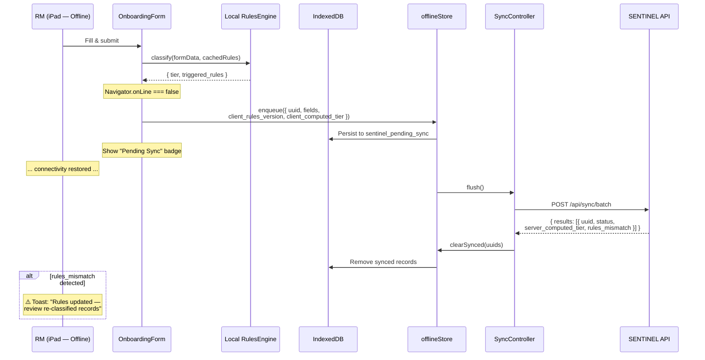
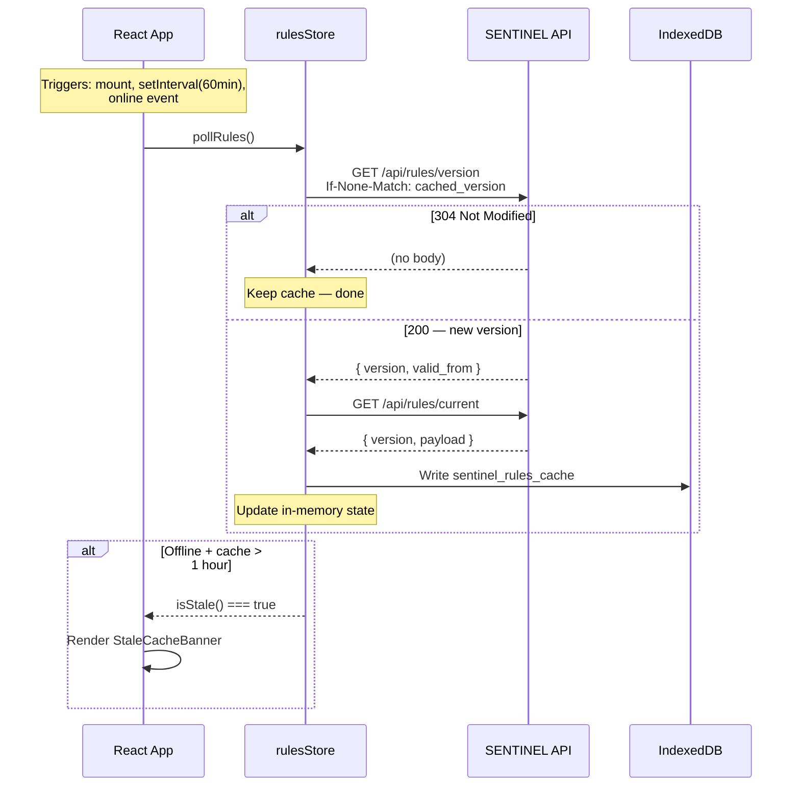
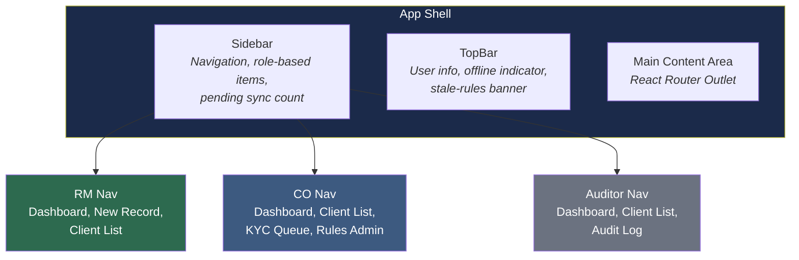
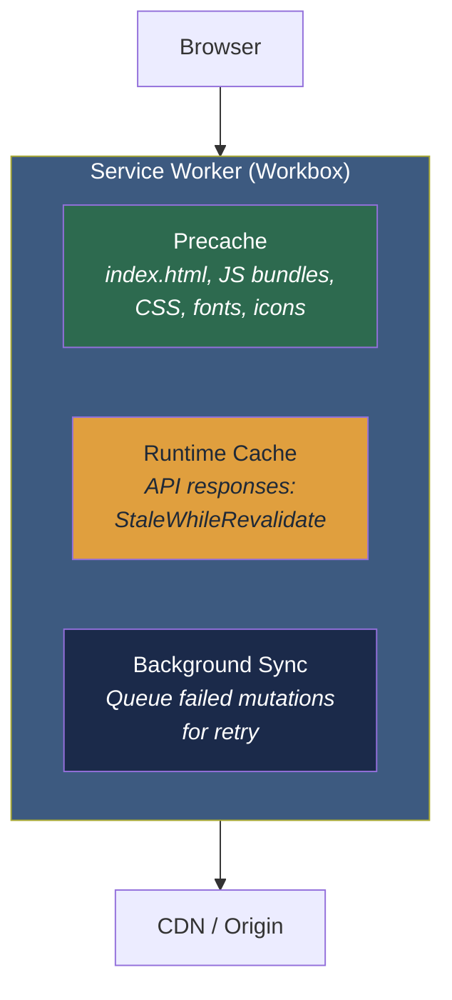
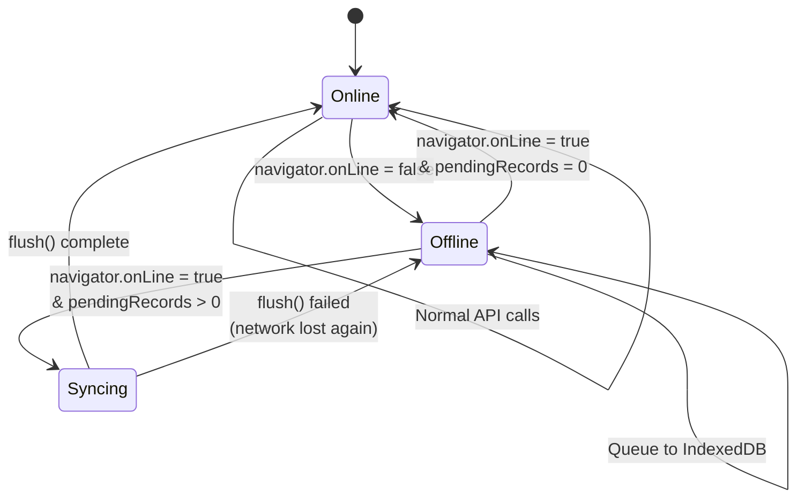
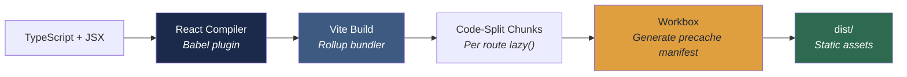

# SENTINEL — Frontend Architecture

_Version:_ 1.0
_Date:_ 2026-04-20
_Status:_ Accepted
_Related:_ [HLD](./hld.md) · [LLD](./lld.md) · [Backend Architecture](./backend-architecture.md) · [ADRs](./adr/)

---

## 1. Architecture Overview

SENTINEL's frontend is a **React 19 SPA/PWA** built with Vite, using Zustand for state management, Tailwind CSS v4 for styling, and React Compiler for automatic memoisation. The app runs on RM iPads (offline-capable), compliance officer desktops, and auditor desktops — all served as a single build with role-based UI gating.

### 1.1 Technology Stack

| Layer             | Technology                            | Rationale                                                                            |
| ----------------- | ------------------------------------- | ------------------------------------------------------------------------------------ |
| **Framework**     | React 19 + React Compiler             | Automatic memoisation eliminates manual `useMemo`/`useCallback`; concurrent features |
| **Build Tool**    | Vite 6                                | Fast HMR, ESBuild-powered dev server, Rollup production bundles                      |
| **State**         | Zustand 5                             | Minimal boilerplate, slice pattern for bounded contexts, middleware support          |
| **Styling**       | Tailwind CSS v4                       | Utility-first, design-token driven, zero runtime CSS-in-JS overhead                  |
| **UI Components** | shadcn/ui                             | Copy-paste primitives built on Radix UI; fully customisable source code              |
| **Routing**       | React Router v7                       | File-convention routing, loaders, lazy route splitting                               |
| **Forms**         | React Hook Form + Zod                 | Performant uncontrolled forms; Zod schema validation (shared with API DTOs)          |
| **Data Fetching** | TanStack Query v5                     | Cache, retry, background refetch, optimistic updates, offline support                |
| **Offline**       | IndexedDB (via `idb-keyval`) + SW     | Workbox service worker for asset caching; IndexedDB for data persistence             |
| **HTTP Client**   | `ky` (Fetch wrapper)                  | Lightweight, retry, hooks, timeout — replaces Axios                                  |
| **Tables**        | TanStack Table v8                     | Headless, filterable, sortable, virtualised for large datasets                       |
| **Charts**        | Recharts (via shadcn/ui Chart)        | Composable chart primitives with shadcn theming                                      |
| **Icons**         | Lucide React                          | Tree-shakeable, consistent stroke-width, MIT licence (shadcn default)                |
| **Testing**       | Vitest + Testing Library + Playwright | Unit/integration (Vitest), E2E (Playwright)                                          |

### 1.2 Design Principles

| Principle                   | Application                                                                               |
| --------------------------- | ----------------------------------------------------------------------------------------- |
| **Feature-Sliced**          | Code organised by bounded context, not by file type — mirrors backend DDD modules         |
| **Offline-First**           | All writes queue to IndexedDB; sync on reconnect; stale-cache warnings for rules          |
| **Server-Authoritative**    | Client-side classification is a convenience; server re-classifies on sync (ADR-0008)      |
| **Role-Gated UI**           | Components render conditionally per role; routes protected by guards                      |
| **Tablet-Optimised**        | 44×44 px tap targets; iPad landscape (1024×768) as primary viewport                       |
| **Zero Manual Memoisation** | React Compiler handles re-render optimisation — no `React.memo`, `useMemo`, `useCallback` |

---

## 2. System Context



---

## 3. Project Structure

```
sentinel-app/
├── index.html
├── vite.config.ts                    # Vite + React Compiler (babel plugin)
├── tailwind.config.ts                # Design tokens, brand palette
├── tsconfig.json
├── package.json
│
├── public/
│   └── manifest.json                 # PWA manifest
│
├── components.json                   # shadcn/ui config (aliases, style, base library)
│
├── src/
│   ├── main.tsx                      # React root, QueryClient, Router
│   ├── app.tsx                       # Root layout, Sidebar, role context
│   │
│   ├── components/
│   │   ├── ui/                       # shadcn/ui primitives (added via CLI)
│   │   │   ├── button.tsx            # npx shadcn@latest add button
│   │   │   ├── badge.tsx
│   │   │   ├── card.tsx
│   │   │   ├── dialog.tsx
│   │   │   ├── input.tsx
│   │   │   ├── select.tsx
│   │   │   ├── table.tsx
│   │   │   ├── tabs.tsx
│   │   │   ├── separator.tsx
│   │   │   ├── skeleton.tsx
│   │   │   ├── alert.tsx
│   │   │   ├── avatar.tsx
│   │   │   ├── sheet.tsx
│   │   │   ├── sidebar.tsx
│   │   │   ├── switch.tsx
│   │   │   ├── toggle-group.tsx
│   │   │   ├── tooltip.tsx
│   │   │   ├── scroll-area.tsx
│   │   │   ├── chart.tsx             # Recharts wrapper with brand theming
│   │   │   ├── field.tsx             # FieldGroup, Field, FieldLabel, FieldDescription
│   │   │   ├── input-group.tsx
│   │   │   └── ...                   # Additional primitives added as needed
│   │   ├── layout/                   # Shell, Sidebar, TopBar, PageContainer
│   │   └── feedback/                 # ErrorBoundary, OfflineBanner, StaleCacheBanner
│   │
│   ├── shared/                       # Cross-cutting utilities
│   │   ├── api/
│   │   │   └── client.ts             # ky instance, base URL, auth interceptor
│   │   ├── hooks/
│   │   │   ├── use-online-status.ts  # Navigator.onLine + event listeners
│   │   │   ├── use-role.ts           # Current user role from auth store
│   │   │   └── use-debounce.ts
│   │   ├── lib/
│   │   │   ├── utils.ts             # cn() helper (clsx + tailwind-merge) — shadcn convention
│   │   │   ├── idb.ts               # IndexedDB helpers (idb-keyval wrapper)
│   │   │   ├── rules-engine.ts      # Pure classify() function — shared with backend
│   │   │   └── csv-parser.ts        # Papa Parse wrapper for CSV import
│   │   ├── types/
│   │   │   ├── onboarding.types.ts
│   │   │   ├── kyc.types.ts
│   │   │   ├── audit.types.ts
│   │   │   ├── rules.types.ts
│   │   │   └── auth.types.ts
│   │   └── constants/
│   │       ├── roles.ts              # RM, COMPLIANCE_OFFICER, AUDITOR
│   │       └── routes.ts             # Route path constants
│   │
│   ├── stores/                       # Zustand stores (slice pattern)
│   │   ├── auth.store.ts             # User session, role, JWT
│   │   ├── rules.store.ts            # Cached rules, version, polling state
│   │   ├── offline.store.ts          # Pending sync queue, online status
│   │   └── ui.store.ts               # Sidebar state, toast queue, modals
│   │
│   ├── features/                     # Feature modules — mirror backend bounded contexts
│   │   ├── onboarding/
│   │   │   ├── api/
│   │   │   │   └── onboarding.api.ts # TanStack Query hooks: useClients, useSubmitRecord
│   │   │   ├── components/
│   │   │   │   ├── onboarding-form.tsx
│   │   │   │   ├── client-list.tsx
│   │   │   │   ├── client-detail.tsx
│   │   │   │   ├── risk-badge.tsx
│   │   │   │   ├── mismatch-flag.tsx
│   │   │   │   └── csv-import-dialog.tsx
│   │   │   ├── hooks/
│   │   │   │   └── use-classification.ts  # Runs local rules engine on form data
│   │   │   ├── schemas/
│   │   │   │   └── onboarding.schema.ts   # Zod schema for form validation
│   │   │   └── pages/
│   │   │       ├── onboarding-page.tsx
│   │   │       └── client-detail-page.tsx
│   │   │
│   │   ├── kyc/
│   │   │   ├── api/
│   │   │   │   └── kyc.api.ts
│   │   │   ├── components/
│   │   │   │   ├── kyc-status-badge.tsx
│   │   │   │   ├── kyc-update-dialog.tsx
│   │   │   │   └── edd-notice.tsx
│   │   │   └── pages/
│   │   │       └── kyc-dashboard-page.tsx
│   │   │
│   │   ├── audit/
│   │   │   ├── api/
│   │   │   │   └── audit.api.ts
│   │   │   ├── components/
│   │   │   │   ├── audit-log-table.tsx
│   │   │   │   ├── audit-filter-bar.tsx
│   │   │   │   └── audit-diff-viewer.tsx
│   │   │   └── pages/
│   │   │       └── audit-page.tsx
│   │   │
│   │   ├── rules-admin/
│   │   │   ├── api/
│   │   │   │   └── rules.api.ts
│   │   │   ├── components/
│   │   │   │   ├── rules-version-list.tsx
│   │   │   │   └── rules-upload-dialog.tsx
│   │   │   └── pages/
│   │   │       └── rules-admin-page.tsx
│   │   │
│   │   └── dashboard/
│   │       ├── components/
│   │       │   ├── risk-distribution-chart.tsx
│   │       │   ├── branch-summary-card.tsx
│   │       │   ├── pending-sync-card.tsx
│   │       │   └── open-findings-card.tsx
│   │       └── pages/
│   │           └── dashboard-page.tsx
│   │
│   ├── router/
│   │   ├── index.tsx                  # Route definitions with lazy loading
│   │   ├── role-guard.tsx             # Route-level role protection
│   │   └── routes.ts                  # Route config array
│   │
│   └── workers/
│       └── sw.ts                      # Workbox service worker registration
```

---

## 4. State Management — Zustand Slice Architecture

Zustand stores are organised as **independent slices** — one per concern, no single monolithic store. Each slice is a standalone `create()` call.



### 4.1 Store Definitions

#### Auth Store

```typescript
interface AuthState {
  user: User | null;
  role: Role | null;
  token: string | null;
  login: (credentials: LoginDto) => Promise<void>;
  logout: () => void;
  isAuthenticated: () => boolean;
}
```

#### Rules Store

```typescript
interface RulesState {
  version: string | null;
  payload: RulesPayload | null;
  cachedAt: number | null;
  isStale: () => boolean; // cachedAt > 1 hour ago AND offline
  pollRules: () => Promise<void>; // GET /api/rules/version → conditional fetch
  getClassifier: () => (record: ClassifiableRecord) => ClassificationResult;
}
```

#### Offline Store

```typescript
interface OfflineState {
  pendingRecords: OfflineRecord[];
  isOnline: boolean;
  enqueue: (record: OfflineRecord) => void;
  flush: () => Promise<SyncBatchResult>; // POST /api/sync/batch
  clearSynced: (uuids: string[]) => void;
  pendingCount: () => number;
}
```

### 4.2 Persistence Strategy

| Store     | Backend      | Key                     | Rationale                                              |
| --------- | ------------ | ----------------------- | ------------------------------------------------------ |
| `rules`   | IndexedDB    | `sentinel_rules_cache`  | Rules payload can be large; survives tab/browser close |
| `offline` | IndexedDB    | `sentinel_pending_sync` | Offline records must never be lost (NFR-05)            |
| `auth`    | localStorage | `sentinel_auth`         | Small payload; fast synchronous reads for guards       |
| `ui`      | localStorage | `sentinel_ui_prefs`     | Sidebar state, theme — non-critical                    |

---

## 5. Data Flow Patterns

### 5.1 Online Onboarding Submission



### 5.2 Offline Onboarding with Sync



### 5.3 Rules Polling (ADR-0008)



---

## 6. Component Architecture

### 6.1 Layout Structure



### 6.2 Page Hierarchy

| Page              | Route                 | Role(s)     | Key Components                                             |
| ----------------- | --------------------- | ----------- | ---------------------------------------------------------- |
| Dashboard         | `/`                   | All         | RiskDistributionChart, BranchSummaryCard, PendingSyncCard  |
| New Onboarding    | `/onboarding/new`     | RM          | OnboardingForm, RiskBadge (real-time), EddNotice           |
| Client List       | `/clients`            | All         | ClientList (TanStack Table), filters, search, MismatchFlag |
| Client Detail     | `/clients/:id`        | All         | ClientDetail, CorrectionChain, AuditDiffViewer             |
| Submit Correction | `/clients/:id/review` | RM          | OnboardingForm (pre-filled), correction reason             |
| KYC Dashboard     | `/kyc`                | CO          | KYC queue table, KycUpdateDialog, EddNotice                |
| Audit Log         | `/audit`              | Auditor, CO | AuditLogTable, AuditFilterBar, AuditDiffViewer             |
| Rules Admin       | `/rules`              | CO          | RulesVersionList, RulesUploadDialog                        |

### 6.3 shadcn/ui Component Map

All UI primitives are sourced from **shadcn/ui** (`npx shadcn@latest add <component>`) and themed via CSS variables to match the Halcyon Capital brand (NFR-13, NFR-14). Components are owned as source code in `src/components/ui/`.

| shadcn Component       | SENTINEL Usage                                                                         |
| ---------------------- | -------------------------------------------------------------------------------------- |
| `Button`               | All actions. Variants: `default` (brand primary), `destructive`, `outline`, `ghost`    |
| `Badge`                | Risk tier (HIGH/MEDIUM/LOW), KYC status, sync status. Uses semantic color variants     |
| `Card`                 | Dashboard cards, client detail sections. Full composition: `CardHeader`→`CardContent`  |
| `Input`                | All text inputs. 44px `min-h` for tablet tap targets (NFR-02)                          |
| `Select`               | Country, source of funds, client type dropdowns. `SelectItem` inside `SelectGroup`     |
| `Switch`               | Boolean toggles: PEP status, sanctions match, adverse media, doc complete              |
| `Table`                | Client list, audit log. Composed with TanStack Table for sorting/filtering             |
| `Dialog`               | CSV import preview, KYC update, rules upload. Always includes `DialogTitle`            |
| `Sheet`                | Mobile sidebar panel. Includes `SheetTitle` (sr-only if visually hidden)               |
| `Sidebar`              | App shell navigation with role-based menu items and pending-sync count badge           |
| `Tabs`                 | Client detail view (Overview / Audit Trail / Corrections). `TabsTrigger` in `TabsList` |
| `Alert`                | EDD notice, mismatch warning, stale-rules warning. Not custom styled divs              |
| `Skeleton`             | Loading placeholders for tables, cards, detail views                                   |
| `Separator`            | Section dividers. Not `<hr>` or `border-t` divs                                        |
| `Tooltip`              | Info icons on form fields, triggered-rules explanation                                 |
| `ScrollArea`           | Audit log table with virtualised scrolling                                             |
| `Avatar`               | RM avatars in client list. Always includes `AvatarFallback`                            |
| `Chart`                | Risk distribution chart, branch summary. Wraps Recharts with brand palette             |
| `ToggleGroup`          | Filter bar: risk tier toggle (HIGH/MEDIUM/LOW), KYC status toggle                      |
| `Sonner` (toast)       | Success/error/warning notifications. `toast()` from `sonner` — not custom Toast        |
| `Field` / `FieldGroup` | Form layout. All form fields use `FieldGroup` → `Field` — never raw divs               |
| `InputGroup`           | Inputs with icons/addons. Uses `InputGroupInput` — never raw `Input` inside            |

### 6.4 shadcn/ui Conventions

| Rule                                  | Rationale                                                              |
| ------------------------------------- | ---------------------------------------------------------------------- |
| Use `gap-*` not `space-y-*`           | shadcn convention; works with flex/grid layout                         |
| Use `size-*` for equal width/height   | `size-10` not `w-10 h-10`                                              |
| Icons use `data-icon` in buttons      | `<Icon data-icon="inline-start" />` — components handle sizing via CSS |
| Use semantic colors                   | `bg-primary`, `text-muted-foreground` — never raw hex in className     |
| Use `cn()` for conditional classes    | From `@/lib/utils.ts` — `clsx` + `tailwind-merge`                      |
| No manual `dark:` color overrides     | Use CSS variables; shadcn handles light/dark via `@theme`              |
| No manual `z-index` on overlays       | `Dialog`, `Sheet`, `Popover` handle their own stacking                 |
| `DialogTitle` / `SheetTitle` required | Accessibility — use `className="sr-only"` if visually hidden           |

### 6.5 Custom Components (non-shadcn)

Only components with SENTINEL-specific logic that have no shadcn equivalent:

| Component          | Description                                                      |
| ------------------ | ---------------------------------------------------------------- |
| `OfflineBanner`    | Fixed top bar when `!navigator.onLine` (uses `Alert` internally) |
| `StaleCacheBanner` | Warning when rules cache > 1 hour stale (uses `Alert`)           |
| `RiskBadge`        | `Badge` variant wrapper with risk-tier colour mapping            |
| `KycStatusBadge`   | `Badge` variant wrapper with KYC status colour mapping           |
| `AuditDiffViewer`  | Before/after JSON diff display for audit entries                 |
| `RoleGate`         | Conditional render based on user role                            |

---

## 7. Styling Architecture — Tailwind CSS v4 + shadcn/ui Theming

### 7.1 Design Tokens

shadcn/ui uses CSS custom properties for theming. The Halcyon brand values (NFR-13/NFR-14) are mapped to shadcn's semantic colour variables in the global CSS file:

```css
/* app.css — Tailwind v4 + shadcn/ui theme layer */
@import "tailwindcss";

@theme inline {
  /* --- shadcn/ui semantic tokens mapped to Halcyon brand --- */
  --color-background: oklch(1 0 0); /* #FFFFFF */
  --color-foreground: oklch(0.18 0.04 256); /* #1B2A4A — brand primary */
  --color-primary: oklch(0.22 0.06 256); /* #1B2A4A */
  --color-primary-foreground: oklch(1 0 0);
  --color-secondary: oklch(0.35 0.05 256); /* #3D5A80 — brand primary light */
  --color-secondary-foreground: oklch(1 0 0);
  --color-destructive: oklch(0.35 0.15 25); /* #9B2226 — brand error */
  --color-destructive-foreground: oklch(1 0 0);
  --color-muted: oklch(0.96 0.005 260);
  --color-muted-foreground: oklch(0.5 0.02 260);
  --color-accent: oklch(0.95 0.005 260);
  --color-accent-foreground: oklch(0.22 0.06 256);
  --color-card: oklch(1 0 0);
  --color-card-foreground: oklch(0.22 0.06 256);
  --color-border: oklch(0.9 0.005 260);
  --color-ring: oklch(0.22 0.06 256);

  /* --- SENTINEL-specific semantic tokens --- */
  --color-risk-high: oklch(0.35 0.15 25); /* #9B2226 */
  --color-risk-medium: oklch(0.7 0.15 75); /* #E09F3E */
  --color-risk-low: oklch(0.4 0.1 155); /* #2D6A4F */
  --color-success: oklch(0.4 0.1 155); /* #2D6A4F */
  --color-warning: oklch(0.7 0.15 75); /* #E09F3E */

  --font-sans: "Inter", sans-serif;
  --radius: 8px; /* NFR-14: card border-radius */
}

/* Dark mode overrides */
.dark {
  --color-background: oklch(0.15 0.02 256);
  --color-foreground: oklch(0.95 0.005 260);
  --color-primary: oklch(0.65 0.06 256);
  --color-card: oklch(0.18 0.03 256);
  /* ... remaining dark tokens */
}
```

### 7.2 shadcn/ui Configuration

```json
// components.json
{
  "$schema": "https://ui.shadcn.com/schema.json",
  "style": "nova",
  "base": "radix",
  "tailwind": {
    "config": "",
    "css": "src/app.css",
    "cssVariables": true
  },
  "aliases": {
    "components": "@/components",
    "utils": "@/lib/utils",
    "ui": "@/components/ui",
    "hooks": "@/hooks"
  },
  "iconLibrary": "lucide"
}
```

### 7.3 Responsive Breakpoints

| Breakpoint | Width  | Target                                         |
| ---------- | ------ | ---------------------------------------------- |
| `sm`       | 640px  | Mobile (not primary — fallback)                |
| `md`       | 768px  | iPad portrait                                  |
| `lg`       | 1024px | **iPad landscape — primary viewport (NFR-02)** |
| `xl`       | 1280px | Desktop                                        |
| `2xl`      | 1536px | Wide desktop                                   |

### 7.4 Component Styling Approach

- **shadcn semantic colours** — use `bg-primary`, `text-muted-foreground`, `border-destructive` — never raw hex values
- **`cn()` helper** — from `@/lib/utils.ts` (`clsx` + `tailwind-merge`) for conditional/merged classes
- **`className` for layout only** — never override component colours or typography via className; use variants instead
- **No CSS-in-JS runtime** — zero JavaScript bundle cost for styles
- **Dark mode** — `class` strategy (manual toggle via `uiStore`), not `prefers-color-scheme`; shadcn handles colour swap via CSS variables

---

## 8. React Compiler Integration

React Compiler (formerly React Forget) is enabled as a Babel plugin in the Vite build pipeline. It automatically memoises components and hooks — eliminating the need for manual `React.memo`, `useMemo`, and `useCallback`.

### 8.1 Vite Configuration

```typescript
// vite.config.ts
import { defineConfig } from "vite";
import react from "@vitejs/plugin-react";

export default defineConfig({
  plugins: [
    react({
      babel: {
        plugins: [["babel-plugin-react-compiler", {}]],
      },
    }),
  ],
});
```

### 8.2 Coding Guidelines with React Compiler

| Guideline                                      | Rationale                                                         |
| ---------------------------------------------- | ----------------------------------------------------------------- |
| Do NOT use `React.memo()`                      | Compiler handles this automatically                               |
| Do NOT use `useMemo()` / `useCallback()`       | Compiler inserts fine-grained memoisation                         |
| DO use plain functions and objects inline      | Compiler tracks dependencies and caches where beneficial          |
| DO follow Rules of React (pure render, etc.)   | Compiler relies on components being idiomatic React               |
| DO keep side effects in `useEffect` only       | Compiler assumes render is pure — side effects break optimisation |
| Validate with `npx react-compiler-healthcheck` | Run in CI to verify all components are compiler-compatible        |

### 8.3 ESLint Plugin

```json
{
  "plugins": ["eslint-plugin-react-compiler"],
  "rules": {
    "react-compiler/react-compiler": "error"
  }
}
```

---

## 9. Offline Architecture

### 9.1 Service Worker Strategy



### 9.2 Offline Data Stores (IndexedDB)

| Store Name              | Key         | Contents                                                | Eviction          |
| ----------------------- | ----------- | ------------------------------------------------------- | ----------------- |
| `sentinel_rules_cache`  | `rules`     | `{ version, payload, cached_at }`                       | Overwrite on poll |
| `sentinel_pending_sync` | `uuid`      | `{ uuid, fields, client_rules_version, computed_tier }` | Delete on sync    |
| `sentinel_client_cache` | `client_id` | Last-fetched client list for offline browsing           | LRU, max 200      |

### 9.3 Online/Offline State Machine



---

## 10. Routing & Code Splitting

### 10.1 Route Configuration

```typescript
const routes = [
  {
    path: '/',
    element: <AppShell />,
    children: [
      { index: true, lazy: () => import('./features/dashboard/pages/dashboard-page') },
      { path: 'onboarding/new', lazy: () => import('./features/onboarding/pages/onboarding-page') },
      { path: 'clients', lazy: () => import('./features/onboarding/pages/client-list-page') },
      { path: 'clients/:id', lazy: () => import('./features/onboarding/pages/client-detail-page') },
      { path: 'clients/:id/review', lazy: () => import('./features/onboarding/pages/correction-page') },
      { path: 'kyc', lazy: () => import('./features/kyc/pages/kyc-dashboard-page') },
      { path: 'audit', lazy: () => import('./features/audit/pages/audit-page') },
      { path: 'rules', lazy: () => import('./features/rules-admin/pages/rules-admin-page') },
    ],
  },
];
```

### 10.2 Role Guards

| Route                 | Allowed Roles   |
| --------------------- | --------------- |
| `/`                   | RM, CO, Auditor |
| `/onboarding/new`     | RM              |
| `/clients`            | RM, CO, Auditor |
| `/clients/:id`        | RM, CO, Auditor |
| `/clients/:id/review` | RM              |
| `/kyc`                | CO              |
| `/audit`              | Auditor, CO     |
| `/rules`              | CO              |

---

## 11. API Integration Layer

### 11.1 HTTP Client Setup

```typescript
// shared/api/client.ts
import ky from "ky";
import { useAuthStore } from "@/stores/auth.store";

export const api = ky.create({
  prefixUrl: import.meta.env.VITE_API_URL,
  hooks: {
    beforeRequest: [
      (request) => {
        const token = useAuthStore.getState().token;
        if (token) {
          request.headers.set("Authorization", `Bearer ${token}`);
        }
      },
    ],
  },
  retry: { limit: 2, methods: ["get"] },
  timeout: 10_000,
});
```

### 11.2 TanStack Query Convention

Each feature module exports query/mutation hooks from its `api/` folder:

```typescript
// features/onboarding/api/onboarding.api.ts
export const clientKeys = {
  all: ["clients"] as const,
  list: (filters: ClientFilters) =>
    [...clientKeys.all, "list", filters] as const,
  detail: (id: string) => [...clientKeys.all, "detail", id] as const,
};

export function useClients(filters: ClientFilters) {
  return useQuery({
    queryKey: clientKeys.list(filters),
    queryFn: () =>
      api
        .get("clients", { searchParams: filters })
        .json<PaginatedResponse<Client>>(),
  });
}

export function useSubmitOnboarding() {
  const queryClient = useQueryClient();
  return useMutation({
    mutationFn: (data: CreateOnboardingDto) =>
      api.post("onboarding", { json: data }).json<OnboardingResponse>(),
    onSuccess: () =>
      queryClient.invalidateQueries({ queryKey: clientKeys.all }),
  });
}
```

---

## 12. Form Architecture

### 12.1 Onboarding Form Schema (Zod)

The onboarding form validates all 16 fields client-side before submission. The Zod schema mirrors the backend DTO contract.

```typescript
export const onboardingSchema = z.object({
  client_id: z.string().regex(/^CLT-\d{3}$/),
  branch: z.string().min(1),
  onboarding_date: z.string().date(),
  client_name: z.string().min(2).max(100),
  client_type: z.enum(["INDIVIDUAL", "ENTITY"]),
  country_of_tax_residence: z.string().min(1),
  annual_income: z.number().positive(),
  source_of_funds: z.enum([
    "Employment",
    "Business Income",
    "Investment Returns",
    "Inheritance",
    "Property Sale",
    "Pension",
    "Gift",
    "Other",
  ]),
  pep_status: z.boolean(),
  sanctions_screening_match: z.boolean(),
  adverse_media_flag: z.boolean(),
  kyc_status: z.enum([
    "APPROVED",
    "PENDING",
    "REJECTED",
    "ENHANCED_DUE_DILIGENCE",
  ]),
  id_verification_date: z.string().date().optional(),
  relationship_manager: z.string().min(1),
  documentation_complete: z.boolean(),
});
```

### 12.2 Form Layout with shadcn Field Components

Forms use shadcn's `FieldGroup` and `Field` components — never raw `<div>` with `space-y-*`. Validation uses `data-invalid` on `Field` and `aria-invalid` on the control.

```tsx
// features/onboarding/components/onboarding-form.tsx
<form onSubmit={handleSubmit(onSubmit)}>
  <FieldGroup>
    <Field data-invalid={!!errors.client_name}>
      <FieldLabel htmlFor="client_name">Client Name</FieldLabel>
      <Input
        id="client_name"
        aria-invalid={!!errors.client_name}
        {...register("client_name")}
      />
      {errors.client_name && (
        <FieldDescription>{errors.client_name.message}</FieldDescription>
      )}
    </Field>

    <Field>
      <FieldLabel htmlFor="client_type">Client Type</FieldLabel>
      <ToggleGroup
        type="single"
        value={clientType}
        onValueChange={setClientType}
      >
        <ToggleGroupItem value="INDIVIDUAL">Individual</ToggleGroupItem>
        <ToggleGroupItem value="ENTITY">Entity</ToggleGroupItem>
      </ToggleGroup>
    </Field>

    <FieldSet>
      <FieldLegend>Risk Indicators</FieldLegend>
      <Field>
        <div className="flex items-center gap-3">
          <Switch id="pep_status" {...register("pep_status")} />
          <FieldLabel htmlFor="pep_status">
            Politically Exposed Person
          </FieldLabel>
        </div>
      </Field>
      <Field>
        <div className="flex items-center gap-3">
          <Switch id="sanctions" {...register("sanctions_screening_match")} />
          <FieldLabel htmlFor="sanctions">Sanctions Screening Match</FieldLabel>
        </div>
      </Field>
    </FieldSet>
  </FieldGroup>

  <Button type="submit" disabled={isSubmitting}>
    {isSubmitting && <Spinner data-icon="inline-start" />}
    Submit Record
  </Button>
</form>
```

### 12.3 Field-to-Component Mapping

| Onboarding Field              | shadcn Component      | Notes                                       |
| ----------------------------- | --------------------- | ------------------------------------------- |
| `client_id`, `client_name`    | `Input`               | Text input inside `Field`                   |
| `branch`, `country`, `source` | `Select`              | `SelectItem` inside `SelectGroup`           |
| `client_type`                 | `ToggleGroup`         | 2 options — not a `Select`                  |
| `annual_income`               | `Input` (type=number) | Inside `InputGroup` with `£` addon          |
| `pep`, `sanctions`, `adverse` | `Switch`              | Boolean toggles — not `Checkbox`            |
| `documentation_complete`      | `Switch`              | Boolean toggle                              |
| `onboarding_date`, `id_date`  | `Input` (type=date)   | Native date picker for tablet compatibility |
| `kyc_status`                  | `Select`              | 4 enum options                              |
| `relationship_manager`        | `Input`               | Auto-filled from auth context               |

### 12.2 Real-Time Classification

As the RM fills in the form, the local rules engine runs on every relevant field change and displays the computed risk tier immediately (FR-05, NFR-03):

```typescript
// features/onboarding/hooks/use-classification.ts
export function useClassification(formValues: Partial<OnboardingFormData>) {
  const classify = useRulesStore((s) => s.getClassifier());

  // React Compiler auto-memoises — no useMemo needed
  const result = classify({
    pep_status: formValues.pep_status ?? false,
    sanctions_screening_match: formValues.sanctions_screening_match ?? false,
    adverse_media_flag: formValues.adverse_media_flag ?? false,
    country_of_tax_residence: formValues.country_of_tax_residence ?? "",
    client_type: formValues.client_type ?? "INDIVIDUAL",
    annual_income: formValues.annual_income ?? 0,
    source_of_funds: formValues.source_of_funds ?? "Employment",
  });

  return result;
}
```

---

## 13. Security — Frontend

### 13.1 Security Controls

| Concern                     | Mitigation                                                                           |
| --------------------------- | ------------------------------------------------------------------------------------ |
| **XSS**                     | React's default JSX escaping; no `dangerouslySetInnerHTML`; CSP headers via meta tag |
| **Auth Token Storage**      | `localStorage` with short-lived JWT; refresh via secure httpOnly cookie (prod)       |
| **RBAC Enforcement**        | Route guards + conditional rendering; **never trust client — server re-validates**   |
| **Sensitive Data**          | No PII logged to console; IndexedDB data cleared on logout                           |
| **Dependency Supply Chain** | `npm audit` in CI; Renovate for automated dependency updates                         |
| **CSP**                     | `Content-Security-Policy` meta tag; `script-src 'self'`; no inline scripts           |

### 13.2 Role-Based Rendering Pattern

```typescript
// shared/components/role-gate.tsx
export function RoleGate({ allowed, children }: { allowed: Role[]; children: React.ReactNode }) {
  const role = useAuthStore((s) => s.role);
  if (!role || !allowed.includes(role)) return null;
  return <>{children}</>;
}

// Usage
<RoleGate allowed={['COMPLIANCE_OFFICER']}>
  <KycUpdateDialog />
</RoleGate>
```

---

## 14. Testing Strategy

| Layer             | Tool                           | Scope                                                        |
| ----------------- | ------------------------------ | ------------------------------------------------------------ |
| **Unit**          | Vitest                         | Rules engine, Zod schemas, Zustand stores, utility functions |
| **Component**     | Vitest + Testing Library       | Individual components with mocked stores and API             |
| **Integration**   | Vitest + MSW                   | Feature flows with mocked HTTP (MSW service worker)          |
| **E2E**           | Playwright                     | Full user journeys: onboarding, sync, KYC update, audit view |
| **Visual**        | Playwright screenshots         | Regression snapshots for critical pages                      |
| **Accessibility** | axe-core (via Testing Library) | WCAG 2.1 AA checks on all interactive components             |

### 14.1 Test File Convention

```
features/onboarding/
├── components/
│   ├── onboarding-form.tsx
│   └── __tests__/
│       └── onboarding-form.test.tsx
├── hooks/
│   ├── use-classification.ts
│   └── __tests__/
│       └── use-classification.test.ts
```

---

## 15. Build & Deployment

### 15.1 Build Pipeline



### 15.2 Environment Variables

| Variable             | Description                 | Example                     |
| -------------------- | --------------------------- | --------------------------- |
| `VITE_API_URL`       | Backend API base URL        | `http://localhost:8000/api` |
| `VITE_APP_TITLE`     | Application title           | `SENTINEL`                  |
| `VITE_POLL_INTERVAL` | Rules polling interval (ms) | `3600000`                   |

### 15.3 Docker

```dockerfile
# Multi-stage build
FROM node:22-alpine AS build
WORKDIR /app
COPY package*.json ./
RUN npm ci
COPY . .
RUN npm run build

FROM nginx:alpine
COPY --from=build /app/dist /usr/share/nginx/html
COPY nginx.conf /etc/nginx/conf.d/default.conf
EXPOSE 80
```

---

## 16. Performance Budget

| Metric                       | Target          | Enforcement                            |
| ---------------------------- | --------------- | -------------------------------------- |
| First Contentful Paint (FCP) | < 1.5s          | Lighthouse CI                          |
| Largest Contentful Paint     | < 2.5s          | Lighthouse CI                          |
| Total JS bundle (gzipped)    | < 150 KB        | Vite `rollup-plugin-visualizer`        |
| Per-route chunk              | < 30 KB gzipped | `lazy()` code splitting                |
| Classification compute       | < 50ms          | Pure function, no DOM (NFR-03 < 200ms) |
| Time to Interactive          | < 3s on 4G      | Lighthouse CI                          |
